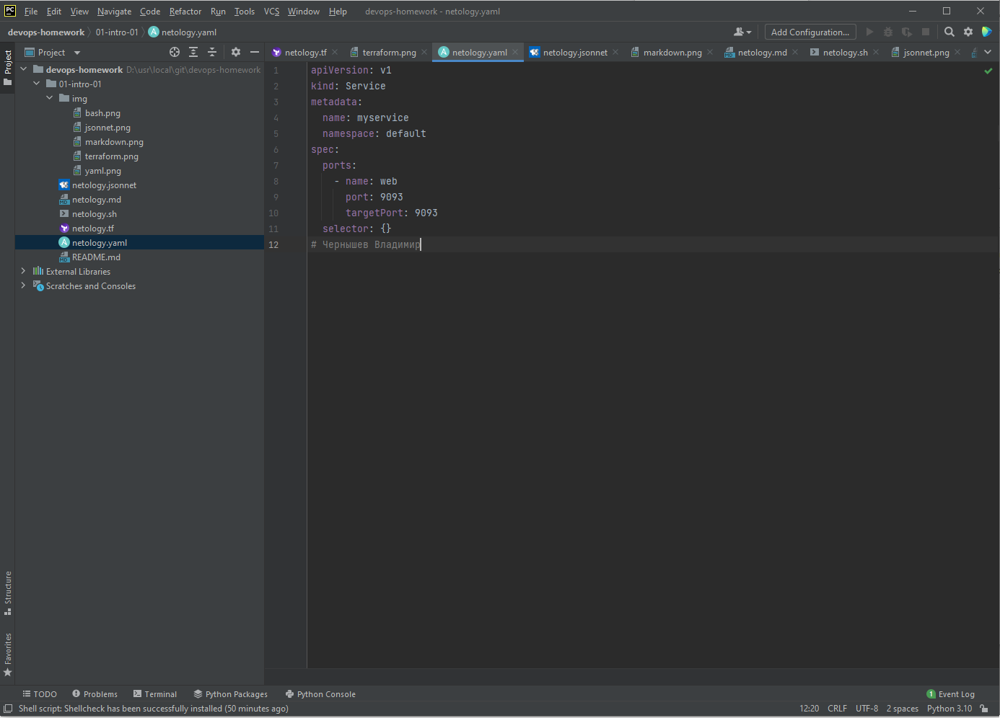
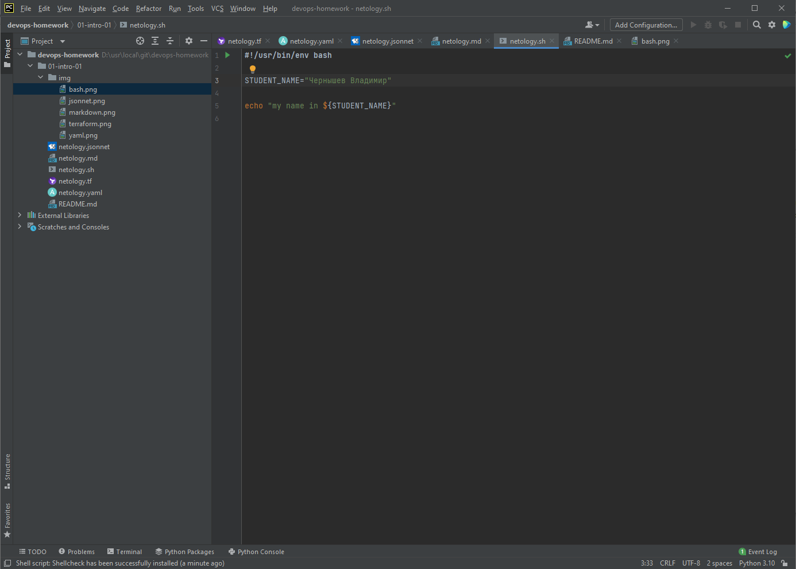
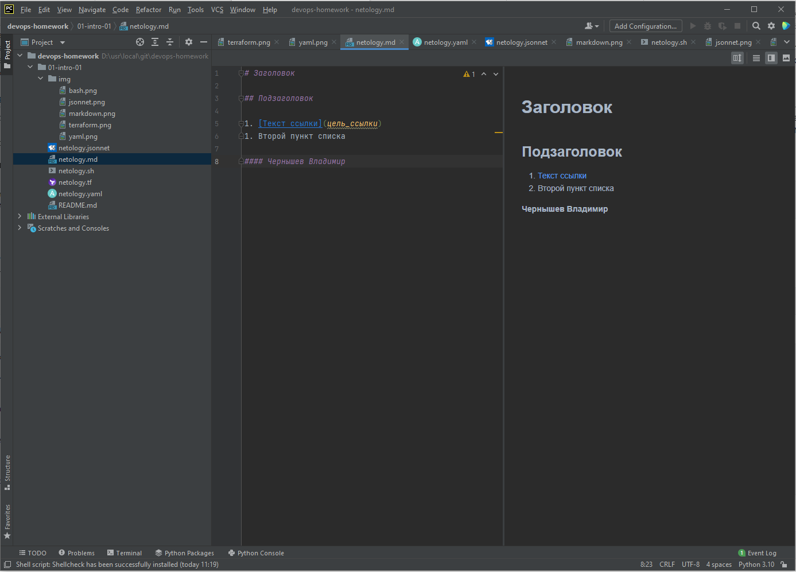
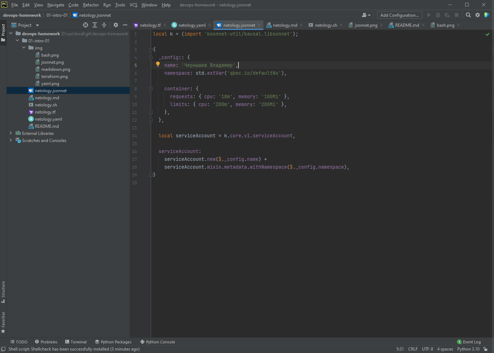

Задание №1 - Подготовка рабочей среды
--
    
Требуемые скриншоты находятся в подкаталоге **img** данного репозитория:
    
### Terraform
 
### Bash

### Markdown

### YAML

### JSONnet

Задание №2 - Описание жизненного цикла задачи (разработки нового функционала)
--
1. Менеджер посредством коммуникации с клиентом формирует ТЗ разработчику;
2. Разработчик создает "доказательство осуществимости" (proof of concept), передает менеджеру;
3. Менеджер получает обратную связь от клиента, краткосрочно планирует задания разработчику;
4. Разработчик выполняет поставленные задания, передает программу команде тестирования;
5. После успешного тестирования программа передается клиенту для эксплуатации;
6. До выпуска новой версии осуществляется техническая поддержка этой версии программы, с известными багами.

