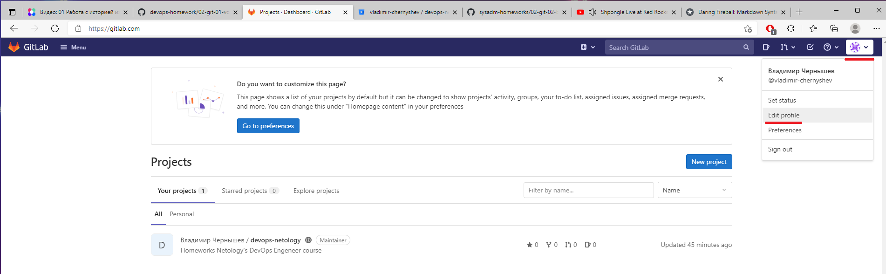
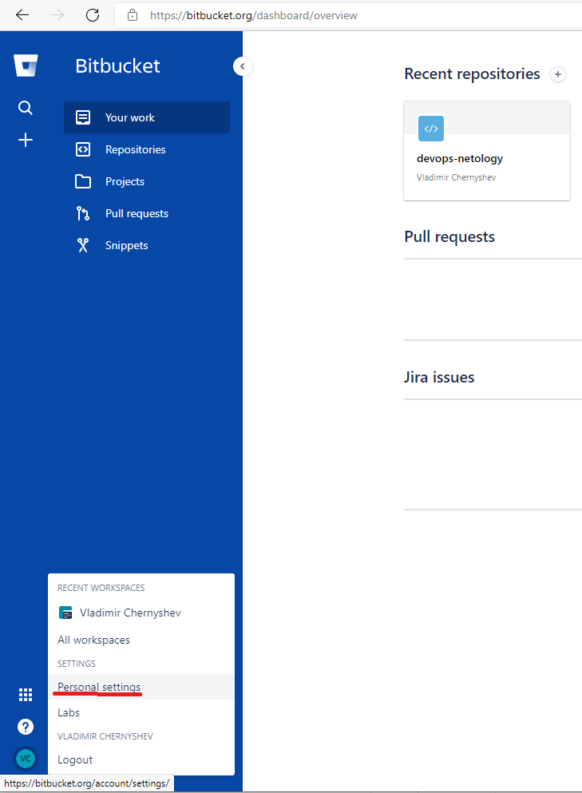

Домашнее задание к занятию «2.2. Основы Git»
===
Задание 1  
---
Для подключения к *gitlab.com* и *bitbucket.org* решено использовать ту же пару ключей, что и для подлючения к *github.vom* (занятие 2.1)

		$cat ~/.ssh/id_ed25519.pub --> gitlab.com > Edit profile > SSH keys

[Gitlab Add an SSH key to your GitLab account](https://docs.gitlab.com/ee/ssh/)

		$cat ~/.ssh/id_ed25519.pub --> bitbucket.org > Personal settings > SSH keys

[Bitbucket Set up an SSH key](https://support.atlassian.com/bitbucket-cloud/docs/set-up-an-ssh-key/)

