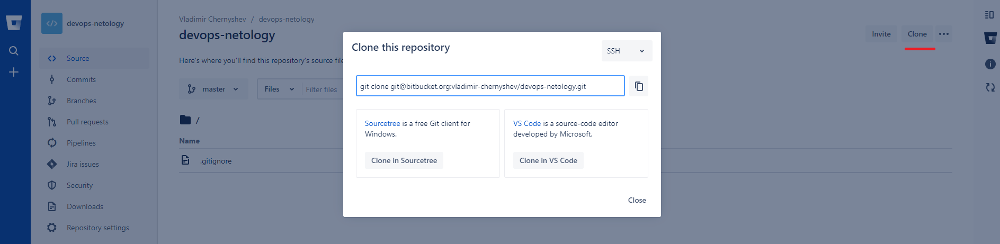

Домашнее задание к занятию «2.2. Основы Git»
===
Подготовка  
---
Для подключения к *gitlab.com* и *bitbucket.org* решено использовать ту же пару ключей, что и для подлючения к *github.vom* (занятие 2.1)
-

		$cat ~/.ssh/id_ed25519.pub --> gitlab.com > Edit profile > SSH keys

[Gitlab Add an SSH key to your GitLab account](https://docs.gitlab.com/ee/ssh/)
-

		$cat ~/.ssh/id_ed25519.pub --> bitbucket.org > Personal settings > SSH keys

[Bitbucket Set up an SSH key](https://support.atlassian.com/bitbucket-cloud/docs/set-up-an-ssh-key/)

Задание 1
---
Исходное состояние: настроен только репозиторий github.com, на репозиторий ссылаемся как на origin:
		v@G713QE:/mnt/c/Games/code/devops-homework$ git remote -v
		origin  git@github.com:vladimir-chernyshev/devops-homework.git (fetch)
		origin  git@github.com:vladimir-chernyshev/devops-homework.git (push)
Добавим gitlab.com под именем gitlab:
		$git remote add gitlab https://gitlab.com/vladimir-chernyshev/devops-netology.git

  
Добавим bitbucket.org под именем bitbucket:
                $git remote add bitbucket git@bitbucket.org:vladimir-chernyshev/devops-netology.git
  
  
Поглядеть:
		v@G713QE:/mnt/c/Games/code/devops-homework$ git remote -v
		bitbucket       git@bitbucket.org:vladimir-chernyshev/devops-netology.git (fetch)
		bitbucket       git@bitbucket.org:vladimir-chernyshev/devops-netology.git (push)
		gitlab  git@gitlab.com:vladimir-chernyshev/devops-netology.git (fetch)
		gitlab  git@gitlab.com:vladimir-chernyshev/devops-netology.git (push)
		origin  git@github.com:vladimir-chernyshev/devops-homework.git (fetch)
		origin  git@github.com:vladimir-chernyshev/devops-homework.git (push)

Зальем локальный репозиторий на gitlab.com:
		v@G713QE:/mnt/c/Games/code/devops-homework$ git push -u gitlab
		The authenticity of host 'gitlab.com (172.65.251.78)' can't be established.
		ECDSA key fingerprint is SHA256:HbW3g8zUjNSksFbqTiUWPWg2Bq1x8xdGUrliXFzSnUw.
		Are you sure you want to continue connecting (yes/no/[fingerprint])? yes
		Warning: Permanently added 'gitlab.com,172.65.251.78' (ECDSA) to the list of known hosts.
		Enumerating objects: 82, done.
		Counting objects: 100% (82/82), done.
		Delta compression using up to 16 threads
		Compressing objects: 100% (74/74), done.
		Writing objects: 100% (82/82), 320.56 KiB | 6.41 MiB/s, done.
		Total 82 (delta 27), reused 15 (delta 0)
		To gitlab.com:vladimir-chernyshev/devops-netology.git
		 * [new branch]      master -> master
		Branch 'master' set up to track remote branch 'master' from 'gitlab'.

Оказывается, по умолчанию на всех трех репозиториях предсуществует бранч master, причем неудаляемый(?). По условиям задачи требуется на всех трех репозиториях создать бранч main.  
[Google-Fu](https://stackoverflow.com/questions/4181861/git-message-src-refspec-master-does-not-match-any-when-pushing-commits-in-git/4183856#4183856)

- GitHub:
		v@G713QE:/mnt/c/Games/code/devops-homework$ git push origin HEAD:main
		Enumerating objects: 11, done.
		Counting objects: 100% (11/11), done.
		Delta compression using up to 16 threads
		Compressing objects: 100% (8/8), done.
		Writing objects: 100% (8/8), 127.52 KiB | 894.00 KiB/s, done.
		Total 8 (delta 1), reused 0 (delta 0)
		remote: Resolving deltas: 100% (1/1), completed with 1 local object.
		remote:
		remote: Create a pull request for 'main' on GitHub by visiting:
		remote:      https://github.com/vladimir-chernyshev/devops-homework/pull/new/main
		remote:
		To github.com:vladimir-chernyshev/devops-homework.git
	 * [new branch]      HEAD -> main

- GitLab:
		v@G713QE:/mnt/c/Games/code/devops-homework$ git push gitlab HEAD:main
		Enumerating objects: 11, done.
		Counting objects: 100% (11/11), done.
		Delta compression using up to 16 threads
		Compressing objects: 100% (8/8), done.
		Writing objects: 100% (8/8), 127.52 KiB | 7.97 MiB/s, done.
		Total 8 (delta 1), reused 0 (delta 0)
		remote:
		remote: To create a merge request for main, visit:
		remote:   https://gitlab.com/vladimir-chernyshev/devops-netology/-/merge_requests/new?merge_request%5Bsource_branch%5D=main
		remote:
		To gitlab.com:vladimir-chernyshev/devops-netology.git
		 * [new branch]      HEAD -> main

- Bitbucket:
		v@G713QE:/mnt/c/Games/code/devops-homework$ git push bitbucket HEAD:main
		The authenticity of host 'bitbucket.org (18.234.32.156)' can't be established.
		RSA key fingerprint is SHA256:zzXQOXSRBEiUtuE8AikJYKwbHaxvSc0ojez9YXaGp1A.
		Are you sure you want to continue connecting (yes/no/[fingerprint])? yes
		Warning: Permanently added 'bitbucket.org,18.234.32.156' (RSA) to the list of known hosts.
		Enumerating objects: 90, done.
		Counting objects: 100% (90/90), done.
		Delta compression using up to 16 threads
		Compressing objects: 100% (82/82), done.
		Writing objects: 100% (90/90), 448.03 KiB | 7.72 MiB/s, done.
		Total 90 (delta 28), reused 15 (delta 0)
		remote:
		remote: Create pull request for main:
		remote:   https://bitbucket.org/vladimir-chernyshev/devops-netology/pull-requests/new?source=main&t=1
		remote:
		To bitbucket.org:vladimir-chernyshev/devops-netology.git
		 * [new branch]      HEAD -> main
