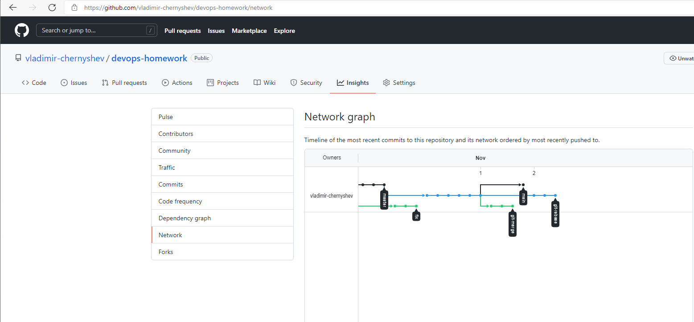
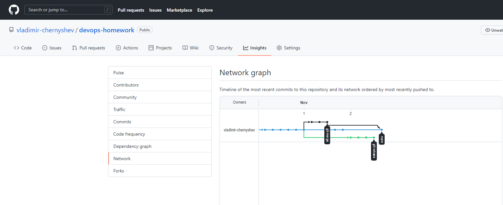
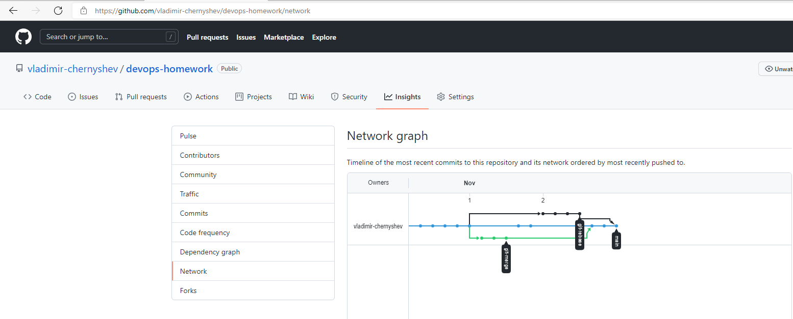

Домашнее задание к занятию «2.3. Ветвления в Git»
===
Подготовка к выполнению задания
---
- Создаем каталоги и два файла _merge.sh_ и _rebase.sh_ идентичного содержания:

		$mkdir -p 02-git-03-branching/branching

		$cat << EOF > 02-git-03-branching/branching/merge.sh
		 #!/bin/bash
		 # display command line options
		
		 count=1
		 for param in "$*"; do
		     echo "\$* Parameter #$count = $param"
		     count=$(( $count + 1 ))
		 done
		 EOF

		$ cp 02-git-03-branching/branching/merge.sh 02-git-03-branching/branching/rebase.sh

- Сделаем предварительный коммит в ветку *main*:

		$ git status
		On branch main
		
		Untracked files:
		  (use "git add <file>..." to include in what will be committed)
		        02-git-03-branching/
		
		$git add .
		$git commit -m 'prepare for merge and rebase'
		$git status
		On branch main
		nothing to commit, working tree clean

Подготовка файла *merge.sh*
---
- Создадим ветку *git-merge*:

		$ git branch
		* main
		  master
		$ git switch -c git-merge
		Switched to a new branch 'git-merge'

- Заменим содержимое файла _merge.sh_ на

		$cat << EOF > 02-git-03-branching/branching/merge.sh
		#!/bin/bash
		# display command line options
		
		count=1
		for param in "$@"; do
		    echo "\$@ Parameter #$count = $param"
		    count=$(( $count + 1 ))
		done
		EOF

- Сделаем коммит и отправим изменения в репозиторий git-merge:

		$ git add .
		$ git commit -m 'merge: @ instead *'
		$ git push -u origin git-merge
		Enumerating objects: 34, done.
		Counting objects: 100% (34/34), done.
		Delta compression using up to 16 threads
		Compressing objects: 100% (20/20), done.
		Writing objects: 100% (24/24), 4.46 KiB | 198.00 KiB/s, done.
		Total 24 (delta 7), reused 0 (delta 0)
		remote: Resolving deltas: 100% (7/7), completed with 4 local objects.
		remote:
		remote: Create a pull request for 'git-merge' on GitHub by visiting:
		remote:      https://github.com/vladimir-chernyshev/devops-homework/pull/new/git-merge
		remote:
		To github.com:vladimir-chernyshev/devops-homework.git
		 * [new branch]      git-merge -> git-merge
		Branch 'git-merge' set up to track remote branch 'git-merge' from 'origin'.

- Внесем еще одно изменение в _merge.sh_:

		$cat << EOF > 02-git-03-branching/branching/merge.sh
		#!/bin/bash
		# display command line options
		
		count=1
		while [[ -n "$1" ]]; do
		    echo "Parameter #$count = $1"
		    count=$(( $count + 1 ))
		    shift
		done
		EOF

- Сделаем коммит и отправим изменения в репозиторий git-merge:

                $ git commit -a -m 'merge: use shift'
                $ git push 

Изменение ветки *main*
---
- Вернемся в ветку *main*:

		$ git switch main
		Switched to branch 'main'

- Изменим файл _rebase.sh_ и отправим изменения в репозиторий *main*:

		cat << EOF > 02-git-03-branching/branching/rebase.sh
		#!/bin/bash
		# display command line options
		
		count=1
		for param in "$@"; do
		    echo "\$@ Parameter #$count = $param"
		    count=$(( $count + 1 ))
		done
		
		echo "====="
		EOF

		$ git add .
		$ git commit -m 'rebase.sh to main'
		$ git push -u origin main
		Enumerating objects: 12, done.
		Counting objects: 100% (12/12), done.
		Delta compression using up to 16 threads
		Compressing objects: 100% (6/6), done.
		Writing objects: 100% (7/7), 1.75 KiB | 199.00 KiB/s, done.
		Total 7 (delta 2), reused 0 (delta 0)
		remote: Resolving deltas: 100% (2/2), completed with 2 local objects.
		To github.com:vladimir-chernyshev/devops-homework.git
		   2e19f73..7e83f47  main -> main
		Branch 'main' set up to track remote branch 'main' from 'origin'.

Подготовка файла _rebase.sh_
---
- Найдем хэш коммита 'prepare for merge and rebase' и сделаем checkout на него:

		$ git log --grep 'prepare for merge and rebase'
		commit 61965401eb79e4edc29644d5986059cc1d9fb2a5
		Author: Vladimir Chernyshev <v.chernyshev@ro.ru>
		Date:   Mon Nov 1 20:57:41 2021 +0500
		
		    prepare for merge and rebase
		$git checkout 61965401eb79e4edc29644d5986059cc1d9fb2a5
		Note: switching to '61965401eb79e4edc29644d5986059cc1d9fb2a5'.
		
		You are in 'detached HEAD' state. You can look around, make experimental
		changes and commit them, and you can discard any commits you make in this
		state without impacting any branches by switching back to a branch.
		
		If you want to create a new branch to retain commits you create, you may
		do so (now or later) by using -c with the switch command. Example:
		
		  git switch -c <new-branch-name>
		
		Or undo this operation with:
		
		  git switch -
		
		Turn off this advice by setting config variable advice.detachedHead to false
		
		HEAD is now at 6196540 prepare for merge and rebase

- Создадим на этом коммите ветку *git-rebase*:

		$ git switch -c git-rebase
Switched to a new branch 'git-rebase'

- Изменим содержимое файла _rebase.sh_ и отправим коммит в ветку *git-rebase*:

		$cat << EOF > 02-git-03-branching/branching/rebase.sh
		#!/bin/bash
		# display command line options
		
		count=1
		for param in "$@"; do
		    echo "Parameter: $param"
		    count=$(( $count + 1 ))
		done
		
		echo "====="
		EOF
		$git add .
		$git commit -m 'git-rebase 1'
		$git push -u origin git-rebase
		Enumerating objects: 12, done.
		Counting objects: 100% (12/12), done.
		Delta compression using up to 16 threads
		Compressing objects: 100% (6/6), done.
		Writing objects: 100% (7/7), 2.41 KiB | 274.00 KiB/s, done.
		Total 7 (delta 1), reused 0 (delta 0)
		remote: Resolving deltas: 100% (1/1), completed with 1 local object.
		remote:
		remote: Create a pull request for 'git-rebase' on GitHub by visiting:
		remote:      https://github.com/vladimir-chernyshev/devops-homework/pull/new/git-rebase
		remote:
		To github.com:vladimir-chernyshev/devops-homework.git
		 * [new branch]      git-rebase -> git-rebase
		Branch 'git-rebase' set up to track remote branch 'git-rebase' from 'origin'.

- Заменим строку _echo "Parameter: $param"_ на _echo "Next parameter: $param"_ и сделаем еще один коммит в *git-rebase*:

		$cat << EOF > 02-git-03-branching/branching/rebase.sh
		#!/bin/bash
		# display command line options
		
		count=1
		for param in "$@"; do
		    echo "Next parameter: $param"
		    count=$(( $count + 1 ))
		done
		
		echo "====="
		EOF
		$ git commit -a -m 'git-rebase 2'
		$ git push
		Enumerating objects: 11, done.
		Counting objects: 100% (11/11), done.
		Delta compression using up to 16 threads
		Compressing objects: 100% (6/6), done.
		Writing objects: 100% (6/6), 781 bytes | 130.00 KiB/s, done.
		Total 6 (delta 3), reused 0 (delta 0)
		remote: Resolving deltas: 100% (3/3), completed with 3 local objects.
		To github.com:vladimir-chernyshev/devops-homework.git
		   69504cb..f5494b5  git-rebase -> git-rebase

- Промежуточный итог:

Merge
---
- Сливаем ветку *git-merge* с веткой *main*

		$git switch main
		Switched to branch 'main'
		Your branch is ahead of 'origin/main' by 1 commit.
		  (use "git push" to publish your local commits)
		
		$git merge git-merge

Rebase
---
- Выполним rebase ветки *git-rebase* на *main*:

		$git checkout git-rebase
		Switched to branch 'git-rebase'
		Your branch is up to date with 'origin/git-rebase'.
		$ git rebase main
		First, rewinding head to replay your work on top of it...
		Fast-forwarded git-rebase to main.
		$git checkout main
		Switched to branch 'main'
		Your branch is up to date with 'origin/main'.
		$git merge git-rebase
		CONFLICT (add/add): Merge conflict in 02-git-03-branching/readme.md
		Auto-merging 02-git-03-branching/readme.md
		Auto-merging 02-git-03-branching/branching/rebase.sh
		CONFLICT (content): Merge conflict in 02-git-03-branching/branching/rebase.sh
		Automatic merge failed; fix conflicts and then commit the result.
		$vi 02-git-03-branching/branching/rebase.sh

			#!/bin/bash
			# display command line options
			
			count=1
			for param in ""; do
			<<<<<<< HEAD
			    echo "$@ Parameter # = "
			=======
			    echo "Next parameter: "
			>>>>>>> git-rebase
			    count=1
			done
			
			echo "====="

		$git add 02-git-03-branching/branching/rebase.sh
		$ git commit -m 'rebase'
		$$ git push
		Enumerating objects: 19, done.
		Counting objects: 100% (18/18), done.
		Delta compression using up to 16 threads
		Compressing objects: 100% (6/6), done.
		Writing objects: 100% (7/7), 968 bytes | 107.00 KiB/s, done.
		Total 7 (delta 2), reused 0 (delta 0)
		remote: Resolving deltas: 100% (2/2), completed with 2 local objects.
		To github.com:vladimir-chernyshev/devops-homework.git
		   43db1f4..45c90e6  main -> main

Переделка задания, начиная с пункта "Подготовка файла rebase.sh."
---
NB! Переделку выполнял с другой (рабочей) машины.

- Переключимся на ветку *main* и найдем коммит с комментарием 'prepare for merge and rebase', от него создадим ветку *git-rebase*:

		$ git switch main
		
		$ git log --grep 'prepare for merge and rebase'
		commit 61965401eb79e4edc29644d5986059cc1d9fb2a5
		Author: Vladimir Chernyshev <v.chernyshev@ro.ru>
		Date:   Mon Nov 1 20:57:41 2021 +0500
		
		    prepare for merge and rebase
		
		$ git checkout 61965401eb79e4edc29644d5986059cc1d9fb2a5
		Note: switching to '61965401eb79e4edc29644d5986059cc1d9fb2a5'.
		
		You are in 'detached HEAD' state. You can look around, make experimental
		changes and commit them, and you can discard any commits you make in this
		state without impacting any branches by switching back to a branch.
				
		If you want to create a new branch to retain commits you create, you may
		do so (now or later) by using -c with the switch command. Example:
		
		  git switch -c <new-branch-name>
		
		Or undo this operation with:
		
		  git switch -
		
		Turn off this advice by setting config variable advice.detachedHead to false
		
		HEAD сейчас на 6196540 prepare for merge and rebase
		
		
		$ git switch -c git-rebase
	
- Изменим содержимое файла _merge.sh_ (на самом деле файл должен называться _rebase.sh_, но этот недочет увидел только после выполнения всей работы), сделаем коммит с комментарием 'git-rebase 1':

		$ cat << EOF > 02-git-03-branching/branching/merge.sh
		#!/bin/bash
		# display command line options
		
		count=1
		for param in "$@"; do
		    echo "Parameter: $param"
		    count=$(( $count + 1 ))
		done
		
		echo "====="
		EOF
		
		$ git add 02-git-03-branching/branching/merge.sh
		
		$ git commit -m 'git-rebase 1'
			
- Вновь изменим содержимое файла _merge.sh_ , сделаем коммит с комментарием 'git-rebase 2':

		$ cat << EOF > 02-git-03-branching/branching/merge.sh
		#!/bin/bash
		# display command line options
		
		count=1
		for param in "$@"; do
			echo "Next parameter: $param"
			count=$(( $count + 1 ))
		done
		
		echo "====="
		EOF

		$ git add 02-git-03-branching/branching/merge.sh
		
		$ git commit -m 'git-rebase 2'
		
		$ git push -f -u origin git-rebase

- Переключаемся на ветку *git-rebase* и выполняем _git rebase -i main_: 
		$ git switch git-rebase
		Переключено на ветку «git-rebase»
		Ваша ветка обновлена в соответствии с «origin/git-rebase».
		
		$git rebase -i main
		
		Автослияние 02-git-03-branching/branching/merge.sh
		КОНФЛИКТ (содержимое): Конфликт слияния в 02-git-03-branching/branching/merge.sh
		error: не удалось применить коммит cee2794… git-rebase 1
		Resolve all conflicts manually, mark them as resolved with
		"git add/rm <conflicted_files>", then run "git rebase --continue".
		You can instead skip this commit: run "git rebase --skip".
		To abort and get back to the state before "git rebase", run "git rebase --abort".
		Could not apply cee2794... git-rebase 1

		$ vi 02-git-03-branching/branching/merge.sh

- Cообщим гиту, что конфликт решен _git add merge.sh_ и продолжим ребейз _git rebase --continue_:

		$ git add 02-git-03-branching/branching/merge.sh
		
		$ git rebase --continue
		
		1 file changed, 4 insertions(+), 2 deletions(-)
		Successfully rebased and updated refs/heads/git-rebase.
		
		$ git push
		To github.com:vladimir-chernyshev/devops-homework.git
		! [rejected]        git-rebase -> git-rebase (non-fast-forward)
		error: не удалось отправить некоторые ссылки в «github.com:vladimir-chernyshev/devops-homework.git»
		подсказка: Обновления были отклонены, так как верхушка вашей текущей ветки
		подсказка: позади ее внешней части. Заберите и слейте внешние изменения
		подсказка: (например, с помощью «git pull …») перед повторной попыткой отправки
		подсказка: изменений.
		подсказка: Для дополнительной информации, смотрите «Note about fast-forwards»
		подсказка: в «git push --help».

- Команда завершится с ошибкой, потому что мы пытаемся перезаписать историю. Чтобы гит позволил нам это сделать, добавим флаг _force_:

		$ git push -u origin git-rebase -f
		Перечисление объектов: 14, готово.
		Подсчет объектов: 100% (14/14), готово.
		При сжатии изменений используется до 2 потоков
		Сжатие объектов: 100% (10/10), готово.
		Запись объектов: 100% (10/10), 1014 байтов | 67.00 КиБ/с, готово.
		Всего 10 (изменений 3), повторно использовано 0 (изменений 0), повторно использовано пакетов 0
		remote: Resolving deltas: 100% (3/3), completed with 1 local object.
		To github.com:vladimir-chernyshev/devops-homework.git
		+ effb000...2bb696e git-rebase -> git-rebase (forced update)
		Ветка «git-rebase» отслеживает внешнюю ветку «git-rebase» из «origin».

- Теперь можно слить ветку *git-rebase* в *main* без конфликтов и без дополнительного мерж-комита простой перемоткой:

		ws-chernyshev-bsd$ git checkout main
		Переключено на ветку «main»
		Ваша ветка обновлена в соответствии с «origin/main».
		ws-chernyshev-bsd$ git merge git-rebase
		Обновление 9ab3f9f..2bb696e
		Fast-forward
		02-git-03-branching/branching/merge.sh | 6 ++++--
		1 file changed, 4 insertions(+), 2 deletions(-)
