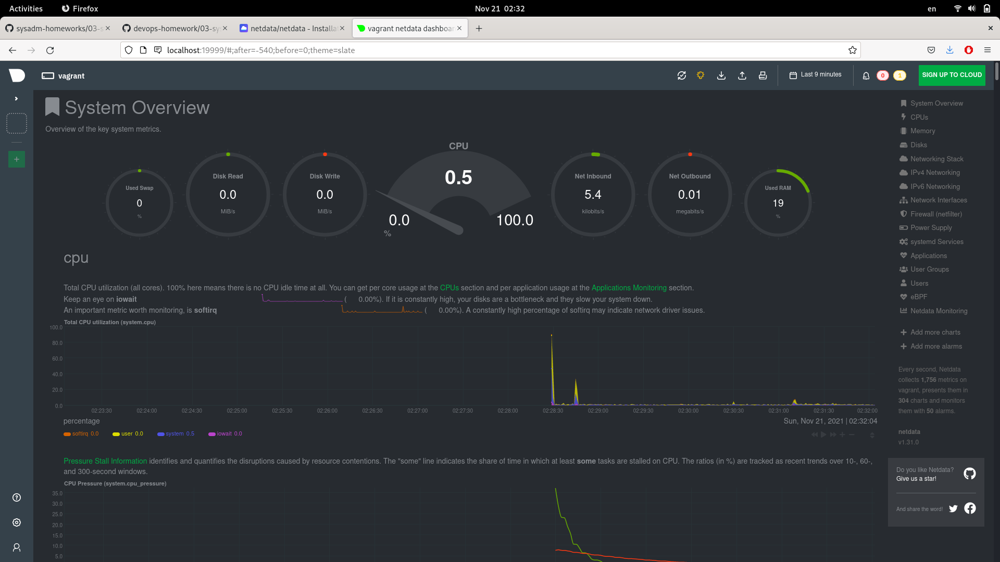
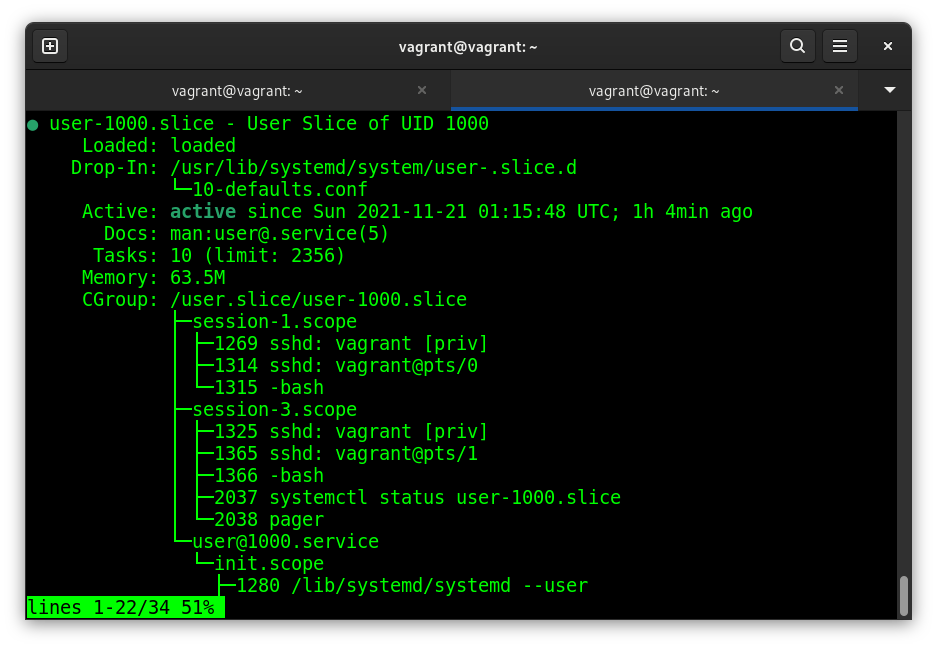

Домашнее задание к занятию "3.4. Операционные системы, лекция 2"
===
1. Используя знания из лекции по systemd, создайте самостоятельно простой unit-файл для node_exporter.
---

Установка **node_exporter** согласно [документа](https://prometheus.io/docs/guides/node-exporter/):

		$wget https://github.com/prometheus/node_exporter/releases/download/v1.3.0/node_exporter-1.3.0.linux-amd64.tar.gz
		$ tar xzf node_exporter-1.3.0.linux-amd64.tar.gz
		$ sudo mv node_exporter-1.3.0.linux-amd64/node_exporter /usr/local/bin/

		$ sudo mkdir /etc/systemd/system/node_exporter.service.d
		$ sudo vi /etc/systemd/system/node_exporter.service

>	[Unit]
>
>	Description=Prometheus exporter
>
>	Documentation=https://github.com/prometheus/node_exporter
>
>	[Install]
>
>	WantedBy=multi-user.target
>
>	[Service]
>
>	ExecStart=/usr/local/bin/node_exporter

		$ sudo systemctl enable node_exporter
		$ sudo systemctl start node_exporter
		$ systemctl status node_exporter
		$ sudo reboot
		$ systemctl status node_exporter

>● node_exporter.service - Prometheus exporter
>
>     Loaded: loaded (/etc/systemd/system/node_exporter.service; enabled; vendor)
>
>     Active: active (running) since Fri 2021-11-19 22:41:58 UTC; 22min ago
>
>       Docs: https://github.com/prometheus/node_exporter
>
>   Main PID: 610 (node_exporter)
>
>      Tasks: 4 (limit: 1071)
>
>     Memory: 13.8M
>
>     CGroup: /system.slice/node_exporter.service
>
>             └─610 /usr/local/bin/node_exporter

		$ sudo systemctl stop node_exporter

2. Ознакомьтесь с опциями **node_exporter** и выводом */metrics* по-умолчанию. Приведите несколько опций, которые вы бы выбрали для базового мониторинга хоста по CPU, памяти, диску и сети.
---

		$ curl http://localhost:9100/metrics | egrep ^node_
		[..]
		$ /usr/local/bin/node_exporter --help

Немного [Google-fu](https://askubuntu.com/questions/659267/how-do-i-override-or-configure-systemd-services):

		$ sudo systemctl edit node_exporter

>	[Service]
>
>	ExecStart=
>
>	ExecStart=/usr/local/bin/node_exporter --collector.disable-defaults --collector.netstat --collector.meminfo --collector.cpu --collector.filesystem

		$ sudo systemctl daemon-reload

3. Установка **Netdata** согласно [документации](https://packagecloud.io/netdata/netdata/install):
---

		$ curl -s https://packagecloud.io/install/repositories/netdata/netdata/script.deb.sh | sudo bash
		$ sudo apt-get install netdata

		$ sudo vi  /etc/netdata/netdata.conf

>	bind to = 0.0.0.0

		$ sudo systemctl enable netdata
		$ sudo systemctl restart netdata

		$ vi Vagrantfile

>	config.vm.network "forwarded_port", guest: 19999, host: 19999

		$ vagrant reload

4. Можно ли по выводу **dmesg** понять, осознает ли ОС, что загружена не на настоящем оборудовании, а на системе виртуализации?
---

[Google-fu](https://ostechnix.com/check-linux-system-physical-virtual-machine/):

		$ sudo dmesg | grep "Hypervisor detected"
		[    0.000000] Hypervisor detected: KVM

5. Как настроен sysctl *fs.nr_open* на системе по-умолчанию? Узнайте, что означает этот параметр. Какой другой существующий лимит не позволит достичь такого числа (**ulimit --help**)?
---

		$ sysctl fs.nr_open
		fs.nr_open = 1048576

 Согласно [документации](https://www.kernel.org/doc/Documentation/sysctl/fs.txt):

>	nr_open:
>
>This denotes the maximum number of file-handles a process can
>allocate. Default value is 1024*1024 (1048576) which should be
>enough for most machines. Actual limit depends on RLIMIT_NOFILE
>resource limit.

Максимальное количество открытых файлов для процесса также регулируется builtin **ulimit**:
"мягкий" лимит, максимальное разрешенное количество открытых файлов процессу:

		$ ulimit -Sn
		1024

"жесткий" лимит, устанавливается администратором. Пользователь имеет право увеличить "мягкий" лимит до значения "жесткого":

		$ ulimit -Hn
		1048576

6. Запустите любой долгоживущий процесс в отдельном неймспейсе процессов; покажите, что ваш процесс работает под PID 1 через **nsenter**.
---

		$ unshare --mount-proc --map-root-user --fork --mount --pid sleep 1h

В соседней консоли:

		$ ps aux | egrep sleep
		vagrant     3333  0.0  0.0   8080   580 pts/1    S+   00:19   0:00 unshare --mount-proc --map-root-user --fork --mount --pid sleep 1h
		vagrant     3334  0.0  0.0   8076   524 pts/1    S+   00:19   0:00 sleep 1h
		vagrant     3338  0.0  0.0   8900   672 pts/0    S+   00:19   0:00 grep -E --color=auto sleep
		$ sudo nsenter --target 3334 --pid --mount
		# ps aux
		USER         PID %CPU %MEM    VSZ   RSS TTY      STAT START   TIME COMMAND
		vagrant        1  0.0  0.0   8076   524 pts/1    S+   00:19   0:00 sleep 1h
		root           2  0.0  0.3   9836  3816 pts/0    S    00:22   0:00 -bash
		root          11  0.0  0.3  11492  3312 pts/0    R+   00:23   0:00 ps aux

7. Найдите информацию о том, что такое *:(){ :|:& };:*. 
---
Согласно [документа](https://tldp.org/LDP/abs/html/special-chars.html):
 - *:*		- null command, NOP
 - *()*		- command group, commands start in subshell
НО
 - *:()*	- colon is acceptable as a function name
 - *{}*		- block of code
 - *|*		- pipe
 - *&*		- run job in background
 - *;*		- command separator

Команда запускает последовательность из безымянной функции, которая в фоновом режиме выполняет NOP pipe NOP, и пустой команды NOP

		$ :(){ :|:& };:
		[..]
		$ dmesg
		cgroup: fork rejected by pids controller in /user.slice/user-1000.slice/session-1.scope

[Объяснение fork-бомбы](https://askubuntu.com/questions/159491/why-did-the-command-make-my-system-lag-so-badly-i-had-to-reboot)
[Объяснение предотвращения fork-бомбы systemd](https://unix.stackexchange.com/questions/469950/why-cant-i-crash-my-system-with-a-fork-bomb)

		 $ systemctl status user-$UID.slice

