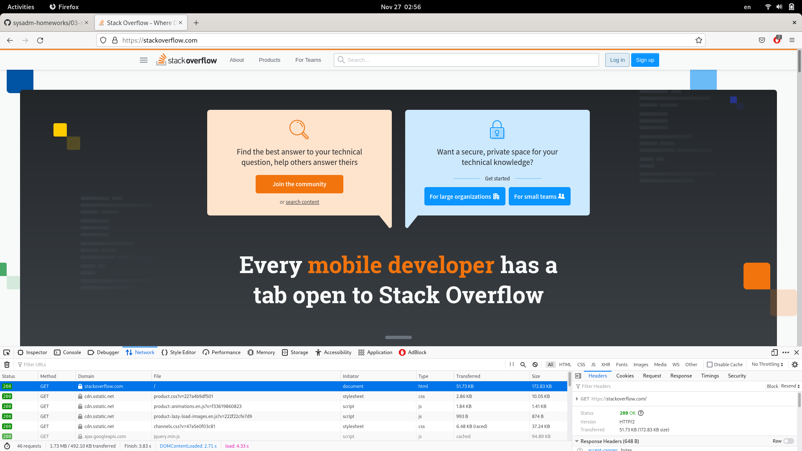
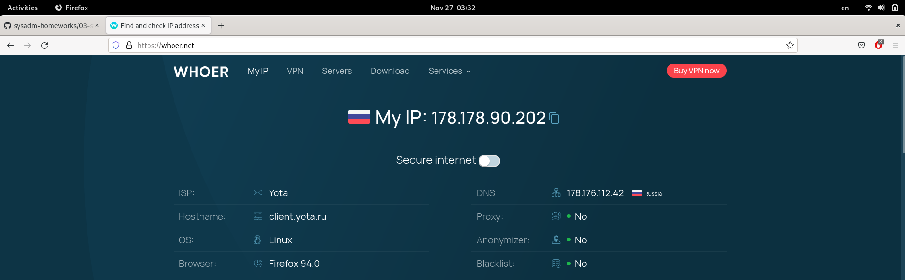
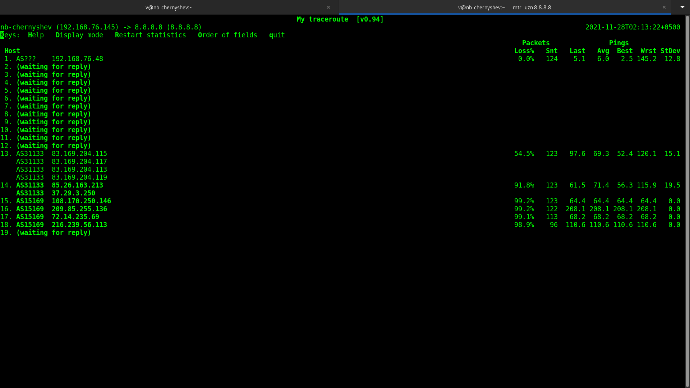

Домашнее задание к занятию "3.6. Компьютерные сети, лекция 1"
===

1. Подключитесь утилитой телнет к сайту stackoverflow.com telnet stackoverflow.com 80. В ответе укажите полученный HTTP код, что он означает?
---

		$ telnet stackoverflow.com 80
>	Trying 151.101.65.69...
>	Connected to stackoverflow.com.
>	Escape character is '^]'.
>	GET /questions HTTP/1.0
>	HOST: stackoverflow.com
>	
>	HTTP/1.1 301 Moved Permanently
>	cache-control: no-cache, no-store, must-revalidate
>	location: https://stackoverflow.com/questions
>	x-request-guid: 30a6dc6c-5d10-4aa7-bf69-ec204de671f4
>	feature-policy: microphone 'none'; speaker 'none'
>	content-security-policy: upgrade-insecure-requests; frame-ancestors 'self' https://stackexchange.com
>	Accept-Ranges: bytes
>	Date: Fri, 26 Nov 2021 21:32:41 GMT
>	Via: 1.1 varnish
>	Connection: close
>	X-Served-By: cache-hhn4024-HHN
>	X-Cache: MISS
>	X-Cache-Hits: 0
>	X-Timer: S1637962362.813128,VS0,VE184
>	Vary: Fastly-SSL
>	X-DNS-Prefetch-Control: off
>	Set-Cookie: prov=23a0167b-1554-1f9d-44b9-ec9e250bfe0a; domain=.stackoverflow.com; expires=Fri, 01-Jan-2055 00:00:00 GMT; path=/; HttpOnly
>	

Сервер вернул код HTTP 301. Согласно п. 6.4.2 [документа](https://www.rfc-editor.org/rfc/inline-errata/rfc7231.html), при получении кодов 3хх и наличии в ответе заголовка Location, клиент должен перенаправить запрос по адресу, указанному в заголовке Location. Код 301 (Moved Permanently) предполагает, что все последующие запросы к ресурсу клиент должен сразу перенаправлять по адресу, указанному в заголовке Location.

2. Повторите задание 1 в браузере используя консоль разработчика F12.
---

 -   откройте вкладку Network
 -   отправте запрос *http://stackoverflow.com*
 -   найдите первый ответ HTTP сервера, откройте вкладку Headers
 -   Укажите в ответе полученный HTTP код.
	Сервер отправил код 200 (ОК), вероятно, браузер Firefox подменил запрос *http://stackoverflow.com* на *https://stackoverflow.com*
 -   Проверьте время загрузки страницы, какой запрос обрабатывался дольше всего?
	Времена обработки запроса находятся на вкладке Timings. Суммарное время загрузки страницы указано в столбце Downloaded: 3.83 с, дольше всего обрабатывался запрос "GET https://stackoverflow.com/" (Downloaded - Started = 1.116 c)
 -   Приложите скриншот консоли браузера в ответ:
	

3. Какой IP адрес у вас в интернете? воспользуйтесь сайтом *whoer.net*.
---

4. Какому провайдеру принадлежит ваш IP адрес? Какой автономной системе AS? воспользуйтесь утилитой **whois**.
---

		$ whois -h whois.ripe.net  178.178.90.202
>	% This is the RIPE Database query service.
>	% The objects are in RPSL format.
>	%
>	% The RIPE Database is subject to Terms and Conditions.
>	% See http://www.ripe.net/db/support/db-terms-conditions.pdf
>	
>	% Note: this output has been filtered.
>	%       To receive output for a database update, use the "-B" flag.
>	
>	% Information related to '178.178.88.0 - 178.178.91.255'
>	
>	% Abuse contact for '178.178.88.0 - 178.178.91.255' is 'abuse-mailbox@megafon.ru'
>	
>	inetnum:        178.178.88.0 - 178.178.91.255
>	netname:        MF_UF_MOBILEPOOL
>	country:        RU
>	admin-c:        MA23317-RIPE
>	tech-c:         MA23317-RIPE
>	status:         ASSIGNED PA
>	mnt-by:         GDC-TR-CoreIP
>	created:        2021-09-28T11:50:19Z
>	last-modified:  2021-09-28T11:50:19Z
>	source:         RIPE
>	
>	role:           Mobile
>	address:        Samara
>	nic-hdl:        MA23317-RIPE
>	mnt-by:         GDC-TR-CoreIP
>	created:        2020-02-05T11:44:29Z
>	last-modified:  2020-02-05T11:44:29Z
>	source:         RIPE # Filtered
>	
>	% Information related to '178.178.88.0/22AS31224'
>	
>	route:          178.178.88.0/22
>	origin:         AS31224
>	descr:          MF-GDC-NAT-UF
>	mnt-by:         MEGAFON-AUTO-MNT
>	mnt-by:         MEGAFON-RIPE-MNT
>	mnt-by:         GDC-TR-CoreIP
>	created:        2021-10-07T11:31:37Z
>	last-modified:  2021-10-07T11:32:54Z
>	source:         RIPE

Провайдер "Мегафон", AS 31224

5. Через какие сети проходит пакет отправленный с вашего компьютера на адрес 8.8.8.8? Через какие AS? воспользуйтесь утилитой **traceroute**
---

		$ traceroute -An  8.8.8.8

>	traceroute to 8.8.8.8 (8.8.8.8), 30 hops max, 60 byte packets
>	 1  192.168.76.48 [*]  6.224 ms  5.847 ms  9.831 ms
>	 2  * * *
>	 3  * * *
>	 4  * * *
>	 5  * * *
>	 6  * * *
>	 7  * * *
>	 8  * * *
>	 9  * * *
>	10  * * *
>	11  * * *
>	12  * * *
>	13  83.169.204.115 [AS31133]  172.438 ms *  172.383 ms
>	14  37.29.3.250 [AS31133]  172.524 ms 85.26.163.213 [AS31133]  172.410 ms 178.176.152.61 [AS31133]  172.183 ms
>	15  108.170.250.51 [AS15169]  172.359 ms * 108.170.250.83 [AS15169]  172.080 ms
>	16  * * 209.85.249.158 [AS15169]  172.300 ms
>	17  108.170.235.204 [AS15169]  172.521 ms 74.125.253.109 [AS15169]  203.921 ms *

6. Повторите задание 5 в утилите **mtr**. На каком участке наибольшая задержка - delay?
---

		$ mtr -uzn 8.8.8.8

7. Какие DNS сервера отвечают за доменное имя dns.google? Какие A записи? воспользуйтесь утилитой **dig**
---

		$ dig dns.google

>	; <<>> DiG 9.16.23-RH <<>> dns.google
>	;; global options: +cmd
>	;; Got answer:
>	;; ->>HEADER<<- opcode: QUERY, status: NOERROR, id: 4808
>	;; flags: qr rd ra; QUERY: 1, ANSWER: 2, AUTHORITY: 0, ADDITIONAL: 1
>	
>	;; OPT PSEUDOSECTION:
>	; EDNS: version: 0, flags:; udp: 65494
>	;; QUESTION SECTION:
>	;dns.google.			IN	A
>	
>	;; ANSWER SECTION:
>	dns.google.		446	IN	A	8.8.8.8
>	dns.google.		446	IN	A	8.8.4.4

>	;; Query time: 119 msec
>	;; SERVER: 127.0.0.53#53(127.0.0.53)
>	;; WHEN: Sun Nov 28 02:47:54 +05 2021
>	;; MSG SIZE  rcvd: 71

		$ dig dns.google NS

>	; <<>> DiG 9.16.23-RH <<>> dns.google NS
>	;; global options: +cmd
>	;; Got answer:
>	;; ->>HEADER<<- opcode: QUERY, status: NOERROR, id: 964
>	;; flags: qr rd ra; QUERY: 1, ANSWER: 4, AUTHORITY: 0, ADDITIONAL: 9
>	
>	;; OPT PSEUDOSECTION:
>	; EDNS: version: 0, flags:; udp: 65494
>	;; QUESTION SECTION:
>	;dns.google.			IN	NS
>	
>	;; ANSWER SECTION:
>	dns.google.		3902	IN	NS	ns1.zdns.google.
>	dns.google.		3902	IN	NS	ns4.zdns.google.
>	dns.google.		3902	IN	NS	ns3.zdns.google.
>	dns.google.		3902	IN	NS	ns2.zdns.google.
>	
>	;; ADDITIONAL SECTION:
>	ns1.zdns.google.	3382	IN	A	216.239.32.114
>	ns2.zdns.google.	3382	IN	A	216.239.34.114
>	ns3.zdns.google.	3382	IN	A	216.239.36.114
>	ns4.zdns.google.	3382	IN	A	216.239.38.114
>	ns1.zdns.google.	3382	IN	AAAA	2001:4860:4802:32::72
>	ns2.zdns.google.	3382	IN	AAAA	2001:4860:4802:34::72
>	ns3.zdns.google.	3382	IN	AAAA	2001:4860:4802:36::72
>	ns4.zdns.google.	3382	IN	AAAA	2001:4860:4802:38::72
>	
>	;; Query time: 113 msec
>	;; SERVER: 127.0.0.53#53(127.0.0.53)
>	;; WHEN: Sun Nov 28 02:48:32 +05 2021
>	;; MSG SIZE  rcvd: 292

8. Проверьте PTR записи для IP адресов из задания 7. Какое доменное имя привязано к IP? воспользуйтесь утилитой **dig**
---

		$ dig -x 8.8.8.8

>	; <<>> DiG 9.16.23-RH <<>> -x 8.8.8.8
>	;; global options: +cmd
>	;; Got answer:
>	;; ->>HEADER<<- opcode: QUERY, status: NOERROR, id: 28778
>	;; flags: qr rd ra; QUERY: 1, ANSWER: 1, AUTHORITY: 0, ADDITIONAL: 1
>	
>	;; OPT PSEUDOSECTION:
>	; EDNS: version: 0, flags:; udp: 65494
>	;; QUESTION SECTION:
>	;8.8.8.8.in-addr.arpa.		IN	PTR
>	
>	;; ANSWER SECTION:
>	8.8.8.8.in-addr.arpa.	7039	IN	PTR	dns.google.

>	;; Query time: 123 msec
>	;; SERVER: 127.0.0.53#53(127.0.0.53)
>	;; WHEN: Sun Nov 28 02:54:05 +05 2021
>	;; MSG SIZE  rcvd: 73

		$ dig -x 8.8.4.4

>	; <<>> DiG 9.16.23-RH <<>> -x 8.8.4.4
>	;; global options: +cmd
>	;; Got answer:
>	;; ->>HEADER<<- opcode: QUERY, status: NOERROR, id: 29516
>	;; flags: qr rd ra; QUERY: 1, ANSWER: 1, AUTHORITY: 0, ADDITIONAL: 1
>	
>	;; OPT PSEUDOSECTION:
>	; EDNS: version: 0, flags:; udp: 65494
>	;; QUESTION SECTION:
>	;4.4.8.8.in-addr.arpa.		IN	PTR
>	
>	;; ANSWER SECTION:
>	4.4.8.8.in-addr.arpa.	10927	IN	PTR	dns.google.
>	
>	;; Query time: 318 msec
>	;; SERVER: 127.0.0.53#53(127.0.0.53)
>	;; WHEN: Sun Nov 28 02:54:14 +05 2021
>	;; MSG SIZE  rcvd: 73

