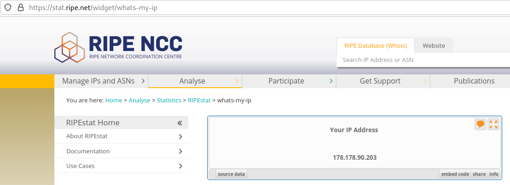

Домашнее задание к занятию "3.8. Компьютерные сети, лекция 3"
===

1. Подключитесь к публичному маршрутизатору в интернет. Найдите маршрут к вашему публичному IP
---

Мой IP   

		$ telnet route-views.routeviews.org
		[..]
>	Username: rviews  
>	route-views>show ip route 178.178.90.203  
>	Routing entry for 178.178.88.0/22  
>	  Known via "bgp 6447", distance 20, metric 0  
>	  Tag 852, type external  
>	  Last update from 154.11.12.212 4w2d ago  
>	  Routing Descriptor Blocks:  
>	  * 154.11.12.212, from 154.11.12.212, 4w2d ago  
>	      Route metric is 0, traffic share count is 1  
>	      AS Hops 4  
>	      Route tag 852  
>	      MPLS label: none  

>route-views>show bgp 178.178.90.203     
>BGP routing table entry for 178.178.88.0/22, version 1247535474
>Paths: (24 available, best #13, table default)
>  Not advertised to any peer
>  Refresh Epoch 1
>  4901 6079 31133 31224 31224, (aggregated by 65269 10.166.219.246)
>    162.250.137.254 from 162.250.137.254 (162.250.137.254)
>      Origin IGP, localpref 100, valid, external
>      Community: 65000:10100 65000:10300 65000:10400
>      path 7FE1035E5270 RPKI State not found
>      rx pathid: 0, tx pathid: 0
>  Refresh Epoch 3
>  3303 31133 31224 31224, (aggregated by 65269 10.166.219.246)
>    217.192.89.50 from 217.192.89.50 (138.187.128.158)
>      Origin IGP, localpref 100, valid, external
>      Community: 0:15169 3303:1004 3303:1006 3303:1030 3303:3056 31133:26149
>      path 7FE1067A7C00 RPKI State not found
>      rx pathid: 0, tx pathid: 0
>  Refresh Epoch 1
>  7660 2516 174 31133 31224 31224, (aggregated by 65269 10.166.219.246)
>    203.181.248.168 from 203.181.248.168 (203.181.248.168)
>      Origin IGP, localpref 100, valid, external
>      Community: 2516:1030 7660:9003
>      path 7FE159024D78 RPKI State not found
>      rx pathid: 0, tx pathid: 0
>  Refresh Epoch 1
>  3267 31133 31224 31224, (aggregated by 65269 10.166.219.246)
>    194.85.40.15 from 194.85.40.15 (185.141.126.1)
>      Origin IGP, metric 0, localpref 100, valid, external
>      path 7FE0C85D1988 RPKI State not found
>      rx pathid: 0, tx pathid: 0
>  Refresh Epoch 1
>  57866 6830 174 31133 31224 31224, (aggregated by 65269 10.166.219.246)
>    37.139.139.17 from 37.139.139.17 (37.139.139.17)
>      Origin IGP, metric 0, localpref 100, valid, external
>      Community: 6830:17000 6830:17504 6830:33125 17152:1 57866:501
>      path 7FE0B3883730 RPKI State not found
>      rx pathid: 0, tx pathid: 0
>  Refresh Epoch 1
>  7018 174 31133 31224 31224, (aggregated by 65269 10.166.219.246)
>    12.0.1.63 from 12.0.1.63 (12.0.1.63)
>      Origin IGP, localpref 100, valid, external
>      Community: 7018:5000 7018:37232
>      path 7FE0F11C6270 RPKI State not found
>      rx pathid: 0, tx pathid: 0
>  Refresh Epoch 1
>  3333 31133 31224 31224, (aggregated by 65269 10.166.219.246)
>    193.0.0.56 from 193.0.0.56 (193.0.0.56)
>      Origin IGP, localpref 100, valid, external
>      path 7FE0E3702D28 RPKI State not found
>      rx pathid: 0, tx pathid: 0
>  Refresh Epoch 1
>  49788 12552 31133 31224 31224, (aggregated by 65269 10.166.219.246)
>    91.218.184.60 from 91.218.184.60 (91.218.184.60)
>      Origin IGP, localpref 100, valid, external
>      Community: 12552:12000 12552:12100 12552:12101 12552:22000
>      Extended Community: 0x43:100:1
>      path 7FE0AA588640 RPKI State not found
>      rx pathid: 0, tx pathid: 0
>  Refresh Epoch 1
>  20912 3257 174 31133 31224 31224, (aggregated by 65269 10.166.219.246)
>    212.66.96.126 from 212.66.96.126 (212.66.96.126)
>      Origin IGP, localpref 100, valid, external
>      Community: 3257:8070 3257:30155 3257:50001 3257:53900 3257:53902 20912:65004
>      path 7FE0D4D2AD50 RPKI State not found
>      rx pathid: 0, tx pathid: 0
>  Refresh Epoch 1
>  8283 31133 31224 31224, (aggregated by 65269 10.166.219.246)
>    94.142.247.3 from 94.142.247.3 (94.142.247.3)
>      Origin IGP, metric 0, localpref 100, valid, external
>      Community: 8283:1 8283:101
>      unknown transitive attribute: flag 0xE0 type 0x20 length 0x18
>        value 0000 205B 0000 0000 0000 0001 0000 205B
>              0000 0005 0000 0001 
>      path 7FE13FB97DA8 RPKI State not found
>      rx pathid: 0, tx pathid: 0
>  Refresh Epoch 1
>  3356 174 31133 31224 31224, (aggregated by 65269 10.166.219.246)
>    4.68.4.46 from 4.68.4.46 (4.69.184.201)
>      Origin IGP, metric 0, localpref 100, valid, external
>      Community: 3356:3 3356:22 3356:86 3356:575 3356:666 3356:903 3356:2012
>      path 7FE162E83FF0 RPKI State not found
>      rx pathid: 0, tx pathid: 0
>  Refresh Epoch 1
>  1221 4637 31133 31224 31224, (aggregated by 65269 10.166.219.246)
>    203.62.252.83 from 203.62.252.83 (203.62.252.83)
>      Origin IGP, localpref 100, valid, external
>      path 7FE0C32D8680 RPKI State not found
>      rx pathid: 0, tx pathid: 0
>  Refresh Epoch 1
>  852 31133 31224 31224, (aggregated by 65269 10.166.219.246)
>    154.11.12.212 from 154.11.12.212 (96.1.209.43)
>      Origin IGP, metric 0, localpref 100, valid, external, best
>      path 7FE0DD128B08 RPKI State not found
>      rx pathid: 0, tx pathid: 0x0
>  Refresh Epoch 1
>  2497 174 31133 31224 31224, (aggregated by 65269 10.166.219.246)
>    202.232.0.2 from 202.232.0.2 (58.138.96.254)
>      Origin IGP, localpref 100, valid, external
>      path 7FE0119D3CC0 RPKI State not found
>      rx pathid: 0, tx pathid: 0
>  Refresh Epoch 1
>  20130 6939 31133 31224 31224, (aggregated by 65269 10.166.219.246)
>    140.192.8.16 from 140.192.8.16 (140.192.8.16)
>      Origin IGP, localpref 100, valid, external
>      path 7FE09C94AA38 RPKI State not found
>      rx pathid: 0, tx pathid: 0
>  Refresh Epoch 1
>  701 174 31133 31224 31224, (aggregated by 65269 10.166.219.246)
>    137.39.3.55 from 137.39.3.55 (137.39.3.55)
>      Origin IGP, localpref 100, valid, external
>      path 7FE0402EAC20 RPKI State not found
>      rx pathid: 0, tx pathid: 0
>  Refresh Epoch 1
>  3257 174 31133 31224 31224, (aggregated by 65269 10.166.219.246)
>    89.149.178.10 from 89.149.178.10 (213.200.83.26)
>      Origin IGP, metric 10, localpref 100, valid, external
>      Community: 3257:8059 3257:30153 3257:50001 3257:54900 3257:54901
>      path 7FE0B0F65438 RPKI State not found
>      rx pathid: 0, tx pathid: 0
>  Refresh Epoch 1
>  53767 174 31133 31224 31224, (aggregated by 65269 10.166.219.246)
>    162.251.163.2 from 162.251.163.2 (162.251.162.3)
>      Origin IGP, localpref 100, valid, external
>      Community: 174:21101 174:22028 53767:5000
>      path 7FE174E20988 RPKI State not found
>      rx pathid: 0, tx pathid: 0
>  Refresh Epoch 1
>  1351 6939 31133 31224 31224, (aggregated by 65269 10.166.219.246)
>    132.198.255.253 from 132.198.255.253 (132.198.255.253)
>      Origin IGP, localpref 100, valid, external
>      path 7FE160EE9D28 RPKI State not found
>      rx pathid: 0, tx pathid: 0
>  Refresh Epoch 1
>  3549 3356 174 31133 31224 31224, (aggregated by 65269 10.166.219.246)
>    208.51.134.254 from 208.51.134.254 (67.16.168.191)
>      Origin IGP, metric 0, localpref 100, valid, external
>      Community: 3356:3 3356:22 3356:86 3356:575 3356:666 3356:903 3356:2011 3549:2581 3549:30840
>      path 7FE122BB7B10 RPKI State not found
>      rx pathid: 0, tx pathid: 0
>  Refresh Epoch 1
>  19214 174 31133 31224 31224, (aggregated by 65269 10.166.219.246)
>    208.74.64.40 from 208.74.64.40 (208.74.64.40)
>      Origin IGP, localpref 100, valid, external
>      Community: 174:21101 174:22028
>      path 7FE18AB90D28 RPKI State not found
>      rx pathid: 0, tx pathid: 0
>  Refresh Epoch 1
>  6939 31133 31224 31224, (aggregated by 65269 10.166.219.246)
>    64.71.137.241 from 64.71.137.241 (216.218.252.164)
>      Origin IGP, localpref 100, valid, external
>      path 7FE144B793B0 RPKI State not found
>      rx pathid: 0, tx pathid: 0
>  Refresh Epoch 1
>  101 11164 2603 31133 31224 31224, (aggregated by 65269 10.166.219.246)
>    209.124.176.223 from 209.124.176.223 (209.124.176.223)
>      Origin IGP, localpref 100, valid, external
>      Community: 0:714 0:2854 0:3216 0:5580 0:6461 0:6939 0:8075 0:8359 0:9002 0:12389 0:12876 0:12989 0:13335 0:15169 0:16265 0:16276 0:16302 0:16509 0:16625 0:20485 0:20764 0:20940 0:21859 0:22697 0:24940 0:32338 0:32590 0:33438 0:33891 0:39832 0:42668 0:46489 0:47541 0:47542 0:49544 0:49981 0:56550 0:56630 0:57976 0:60280 101:20100 101:22100 2603:302 2603:666 2603:65100 11164:1170 11164:7880
>      Extended Community: RT:101:22100
>      path 7FE144B85D30 RPKI State not found
>      rx pathid: 0, tx pathid: 0
>  Refresh Epoch 1
>  3561 209 3356 174 31133 31224 31224, (aggregated by 65269 10.166.219.246)
>    206.24.210.80 from 206.24.210.80 (206.24.210.80)
>      Origin IGP, localpref 100, valid, external
>      path 7FE18AF95B88 RPKI State not found
>      rx pathid: 0, tx pathid: 0

