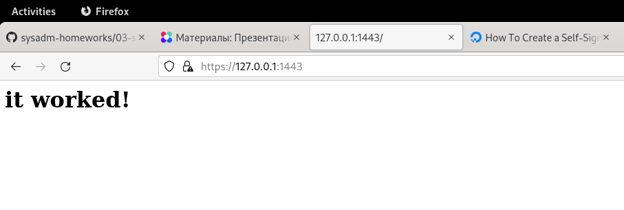

Домашнее задание к занятию "3.9. Элементы безопасности информационных систем"
===

3. Установите apache2, сгенерируйте самоподписанный сертификат, настройте тестовый сайт для работы по HTTPS.
---

		$ sudo apt install apache2
		$ sudo a2enmod ssl
		$ sudo systemctl restart apache2
		$ sudo ufw allow "Apache Full"
		$ sudo openssl req -x509 -nodes -days 3650 -newkey rsa:4096 -keyout /etc/ssl/private/apache-ss.key -out /etc/ssl/certs/apache-ss.cert -subj "/C=RU/ST=Sverdlovskaya/L=Yekaterinburg/O=Tochka/OU=Com/CN=www.tochka.com"

>Generating a RSA private key  
>.....................................++++  
>.........................................................................................++++  
>writing new private key to '/etc/ssl/private/apache-ss.key'  
>-----  

		$ sudo vi /etc/apache2/sites-available/www.tochka.com.conf

<VirtualHost *:443>  
   ServerName www.tochka.com  
   DocumentRoot /var/www/www.tochka.com  

   SSLEngine on  
   SSLCertificateFile /etc/ssl/certs/apache-ss.cert  
   SSLCertificateKeyFile /etc/ssl/private/apache-ss.key  
</VirtualHost>  

		$ sudo mkdir /var/www/www.tochka.com
		$ sudo vi /var/www/www.tochka.com/index.html

<h1>it worked!</h1>  

		$ sudo a2ensite www.tochka.com.conf
Enabling site www.tochka.com.  
To activate the new configuration, you need to run:  
  systemctl reload apache2  

		$ sudo apache2ctl configtest
Syntax OK  

		$ sudo systemctl reload apache2  

После проброса TCP 443 -> 1443 в Vagrantfile:

