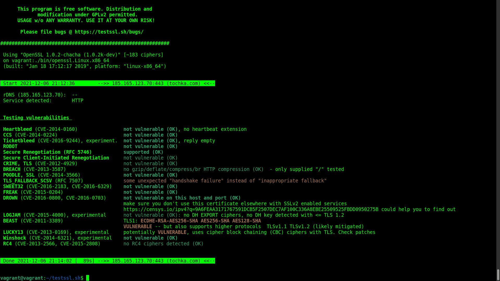
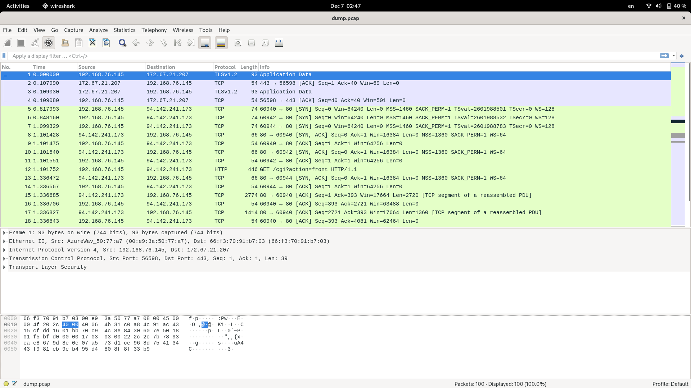

Домашнее задание к занятию "3.9. Элементы безопасности информационных систем"
===

3. Установите apache2, сгенерируйте самоподписанный сертификат, настройте тестовый сайт для работы по HTTPS.
---

		$ sudo apt install apache2
		$ sudo a2enmod ssl
		$ sudo systemctl restart apache2
		$ sudo ufw allow "Apache Full"
		$ sudo openssl req -x509 -nodes -days 3650 -newkey rsa:4096 -keyout /etc/ssl/private/apache-ss.key -out /etc/ssl/certs/apache-ss.cert -subj "/C=RU/ST=Sverdlovskaya/L=Yekaterinburg/O=Tochka/OU=Com/CN=www.tochka.com"

>Generating a RSA private key  
>.....................................++++  
>.........................................................................................++++  
>writing new private key to '/etc/ssl/private/apache-ss.key'  
>-----  

		$ sudo vi /etc/apache2/sites-available/www.tochka.com.conf

><VirtualHost *:443>  
>   ServerName www.tochka.com  
>   DocumentRoot /var/www/www.tochka.com  
>
>   SSLEngine on  
>   SSLCertificateFile /etc/ssl/certs/apache-ss.cert  
>   SSLCertificateKeyFile /etc/ssl/private/apache-ss.key  
></VirtualHost>  

		$ sudo mkdir /var/www/www.tochka.com
		$ sudo vi /var/www/www.tochka.com/index.html

> <h1>it worked!</h1>  

		$ sudo a2ensite www.tochka.com.conf
>Enabling site www.tochka.com.  
>To activate the new configuration, you need to run:  
>  systemctl reload apache2  

		$ sudo apache2ctl configtest
>Syntax OK  

		$ sudo systemctl reload apache2  

После проброса TCP 443 -> 1443 в Vagrantfile:

4. Проверьте на TLS уязвимости произвольный сайт в интернете.
---

		$ git clone --depth 1 https://github.com/drwetter/testssl.sh.git
		$ cd testssl.sh/
		$ ./testssl.sh -U --sneaky https://tochka.com
		[..]

5. Установите на Ubuntu ssh сервер, сгенерируйте новый приватный ключ. Скопируйте свой публичный ключ на другой сервер. Подключитесь к серверу по SSH-ключу.
---

		$ cd ~
		$ ssh-keygen -t ecdsa
>Generating public/private ecdsa key pair.  
>Enter file in which to save the key (/home/vagrant/.ssh/id_ecdsa):   
>Enter passphrase (empty for no passphrase):   
>Enter same passphrase again:   
>Your identification has been saved in /home/vagrant/.ssh/id_ecdsa  
>Your public key has been saved in /home/vagrant/.ssh/id_ecdsa.pub  
>The key fingerprint is:  
>SHA256:VvoylEpb9408mec3Emksfwz6w2sX7Lxs2G/39vmJKnQ vagrant@vagrant  
>The key's randomart image is:  
>+---[ECDSA 256]---+  
>|                 |  
>|                 |  
>|          .      |  
>|         +       |  
>|      . S . . o  |  
>|     . * + E @ o |  
>|      o + o & @ .|  
>|         + . @oXB|  
>|          ..++OO&|  
>+----[SHA256]-----+  

		$ cat .ssh/id_ecdsa.pub >> .ssh/authorized_keys
		$ ssh 127.0.0.1 -i .ssh/id_ecdsa
>The authenticity of host '127.0.0.1 (127.0.0.1)' can't be established.  
>ECDSA key fingerprint is SHA256:wSHl+h4vAtTT7mbkj2lbGyxWXWTUf6VUliwpncjwLPM.  
>Are you sure you want to continue connecting (yes/no/[fingerprint])? yes  
>Warning: Permanently added '127.0.0.1' (ECDSA) to the list of known hosts.  
>Welcome to Ubuntu 20.04.2 LTS (GNU/Linux 5.4.0-80-generic x86_64)  

6. Переименуйте файлы ключей из задания 5. Настройте файл конфигурации SSH клиента, так чтобы вход на удаленный сервер осуществлялся по имени сервера.
---
		$ mv .ssh/id_ecdsa .ssh/ecdsa_local
		$ vi .ssh/config
>Host vagrant  
> HostName vagrant  
> IdentityFile ~/.ssh/ecdsa_local    
> User vagrant  

		$ ssh vagrant
>The authenticity of host 'vagrant (127.0.1.1)' can't be established.  
>ECDSA key fingerprint is SHA256:wSHl+h4vAtTT7mbkj2lbGyxWXWTUf6VUliwpncjwLPM.  
>Are you sure you want to continue connecting (yes/no/[fingerprint])? yes  
>Warning: Permanently added 'vagrant' (ECDSA) to the list of known hosts.  
>Welcome to Ubuntu 20.04.2 LTS (GNU/Linux 5.4.0-80-generic x86_64)  

7. Соберите дамп трафика утилитой tcpdump в формате pcap, 100 пакетов. Откройте файл pcap в Wireshark.
---

		$ sudo tcpdump -c 100 -w dump.pcap

