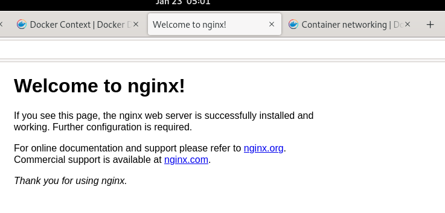
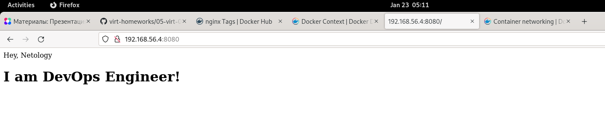

Домашнее задание к занятию "5.3. Введение. Экосистема. Архитектура. Жизненный цикл Docker контейнера"
===

1. Cоздайте свой репозиторий на https://hub.docker.com; выберете любой образ, который содержит веб-сервер Nginx; создайте свой fork образа;
---

		[vagrant@localhost ~]$ docker pull nginx:mainline-alpine

		Emulate Docker CLI using podman. Create /etc/containers/nodocker to quiet msg.

		✔ docker.io/library/nginx:mainline-alpine

		Trying to pull docker.io/library/nginx:mainline-alpine...

		Getting image source signatures

		Copying blob d09cf91cabdc done  

		Copying blob 40e5d2fe5bcd done  

		Copying blob 59bf1c3509f3 done  

		Copying blob 919ade35f869 done  

		Copying blob f3322597df46 done  

		Copying blob 3a97535ac2ef done  

		Copying config cc44224bfe done  

		Writing manifest to image destination

		Storing signatures

		cc44224bfe208a46fbc45471e8f9416f66b75d6307573e29634e7f42e27a9268

		[vagrant@localhost ~]$ sudo touch /etc/containers/nodocker
		[vagrant@localhost ~]$  docker images
		REPOSITORY               TAG              IMAGE ID      CREATED      SIZE
		docker.io/library/nginx  mainline-alpine  cc44224bfe20  3 weeks ago  25 MB

		[vagrant@localhost ~]$  docker run -d --name nginx -p 192.168.56.4:8080:80 cc44224bfe20
		218c448312e9e269ee52c90f82502a9120dd15c0affaf15e90c25b435a769d67
[Network](https://docs.docker.com/config/containers/container-networking/)
		[vagrant@localhost ~]$ docker port -l
		80/tcp -> 192.168.56.4:8080

		[vagrant@localhost ~]$ sudo  firewall-cmd --add-port=8080/tcp --zone=public
		success

Сеть на ноутбуке:
		[v@nb-chernyshev ~]$ ip addr | egrep inet
		    inet 192.168.56.1/24 brd 192.168.56.255 scope global vboxnet0
Сеть на виртуальной машине:
		[vagrant@localhost ~]$ ip addr | egrep inet
		    inet 10.0.2.15/24 brd 10.0.2.255 scope global dynamic noprefixroute eth0
		    inet 192.168.56.4/24 brd 192.168.56.255 scope global dynamic noprefixroute eth1

		[vagrant@localhost ~]$ vi index.html
		<html>
		        <head>
		                Hey, Netology
		        </head>
		<body>
		        <h1>I’m DevOps Engineer!</h1>
		</body>
		</html>

		[vagrant@localhost ~]$ docker cp index.html nginx:/usr/share/nginx/html

		[vagrant@localhost ~]$ docker stop -l
		93d214b1eee7639cde2fe9e70291aa4eed1dedc44241bc4b25cc62b9419ed551

		[vagrant@localhost ~]$  docker  commit nginx -a vladimirchernyshev -m "Changed index.html" -f docker
		WARN[0000] COMMENT is not supported for OCI image format, comment Changed index.html will be ignored. Must use `docker` format 
		Getting image source signatures
		Copying blob 8d3ac3489996 skipped: already exists  
		Copying blob 1c9c1e42aafa skipped: already exists  
		Copying blob 3f87f0a06073 skipped: already exists  
		Copying blob 5ee3266a70bd skipped: already exists  
		Copying blob 0e835d02c1b5 skipped: already exists  
		Copying blob 419df8b60032 skipped: already exists  
		Copying blob 104d02e6ddc1 done  
		Copying config 75ffc05c73 done  
		Writing manifest to image destination
		Storing signatures
		75ffc05c738301a201e9341c240bccbb0a6397feeae061c40616177a4f31b36e

		[vagrant@localhost ~]$ docker  image list
		REPOSITORY               TAG              IMAGE ID      CREATED        SIZE
		<none>                   <none>           75ffc05c7383  3 minutes ago  25 MB
		docker.io/library/nginx  mainline-alpine  cc44224bfe20  3 weeks ago    25 MB

Проверка:

[vagrant@localhost ~]$ docker run -d -p 192.168.56.4:8080:80 75ffc05c7383
cbb6fab46eb174f627ba95a5936daa8dda4cfa49cfac438d4e02ff2cbc192fe6

[Загрузка модифицированного образа в хаб](https://docs.docker.com/docker-hub/repos/):
		[vagrant@localhost ~]$ docker tag 75ffc05c7383 vladimirchernyshev/devops-netology:5.3

		[vagrant@localhost ~]$ docker login docker.io
		Username: vladimirchernyshev
		Password: 
		Login Succeeded!

		[vagrant@localhost ~]$ docker push vladimirchernyshev/devops-netology:5.3
		Getting image source signatures
		Copying blob 3f87f0a06073 skipped: already exists  
		Copying blob 419df8b60032 skipped: already exists  
		Copying blob 1c9c1e42aafa skipped: already exists  
		Copying blob 5ee3266a70bd skipped: already exists  
		Copying blob 0e835d02c1b5 skipped: already exists  
		Copying blob 8d3ac3489996 skipped: already exists  
		Copying blob 104d02e6ddc1 done  
		Copying config 75ffc05c73 done  
		Writing manifest to image destination
		Storing signatures

[Ссылка на репозиторий](https://hub.docker.com/r/vladimirchernyshev/devops-netology)
		[vagrant@localhost ~]$ docker search  vladimirchernyshev 
		INDEX       NAME                                          DESCRIPTION  STARS       OFFICIAL    AUTOMATED
		docker.io   docker.io/vladimirchernyshev/devops-netology               0       

2. Посмотрите на сценарий ниже и ответьте на вопрос: "Подходит ли в этом сценарии использование Docker контейнеров или лучше подойдет виртуальная машина, физическая машина? Может быть возможны разные варианты?"
---

-    Высоконагруженное монолитное java веб-приложение;  
	Подойдут все три варианта, так как нет требований наличия не-Linux операционной системы и даже контейнеризированные приложения выполняются near-native OS
-    Nodejs веб-приложение;  
	Подойдут все три варианта, так как даже контейнеризированные приложения выполняются near-native OS
-    Мобильное приложение c версиями для Android и iOS;  
	Подойдет пара виртуальных машин, так как требуется запуск приложения в разных ОС
-    Шина данных на базе Apache Kafka;
	Подойдут все три варианта, так как даже контейнеризированные приложения выполняются near-native OS
-    Elasticsearch кластер для реализации логирования продуктивного веб-приложения - три ноды elasticsearch, два logstash и две ноды kibana;
	Подойдут все три варианта, так как даже контейнеризированные приложения выполняются near-native OS
-    Мониторинг-стек на базе Prometheus и Grafana;
	Подойдут все три варианта, так как даже контейнеризированные приложения выполняются near-native OS
-    MongoDB, как основное хранилище данных для java-приложения;
	Подойдут все три варианта, так как даже контейнеризированные приложения выполняются near-native OS
-    Gitlab сервер для реализации CI/CD процессов и приватный (закрытый) Docker Registry.
	Подойдут все три варианта, так как даже контейнеризированные приложения выполняются near-native OS

3. Запустите первый контейнер из образа centos c любым тэгом в фоновом режиме, подключив папку /data из текущей рабочей директории на хостовой машине в /data контейнера;
    Запустите второй контейнер из образа debian в фоновом режиме, подключив папку /data из текущей рабочей директории на хостовой машине в /data контейнера;
    Подключитесь к первому контейнеру с помощью docker exec и создайте текстовый файл любого содержания в /data;
    Добавьте еще один файл в папку /data на хостовой машине;
    Подключитесь во второй контейнер и отобразите листинг и содержание файлов в /data контейнера.
---

		[vagrant@localhost ~]$ mkdir data

		[vagrant@localhost ~]$ docker pull centos:centos8
		Resolved "centos" as an alias (/home/vagrant/.cache/containers/short-name-aliases.conf)
		Trying to pull docker.io/library/centos:centos8...
		Getting image source signatures
		Copying blob a1d0c7532777 done  
		Copying config 5d0da3dc97 done  
		Writing manifest to image destination
		Storing signatures
		5d0da3dc976460b72c77d94c8a1ad043720b0416bfc16c52c45d4847e53fadb6

		[vagrant@localhost ~]$ docker pull debian:stable
		✔ docker.io/library/debian:stable
		Trying to pull docker.io/library/debian:stable...
		Getting image source signatures
		Copying blob 8bb8ae9b0185 done  
		Copying config b45e3b4b08 done  
		Writing manifest to image destination
		Storing signatures
		b45e3b4b08de1f577382ba9dce9b9b2c30e20381f5cdb739e6a283f80a8f6464
		
		[vagrant@localhost ~]$ docker image ls
		REPOSITORY                TAG         IMAGE ID      CREATED       SIZE
		docker.io/library/debian  stable      b45e3b4b08de  4 weeks ago   129 MB
		docker.io/library/centos  centos8     5d0da3dc9764  4 months ago  239 MB
		
		[Google-fu](https://forums.docker.com/t/centos-image-is-not-running/14913)

		[vagrant@localhost ~]$ docker run -d -v ./data:/data 5d0da3dc9764 sleep 900
		0e2cc4374921a6bfb44f506562ce046cf70965da8dc7da72057a83eb2f3d0a80
		[vagrant@localhost ~]$ docker run -d -v ./data:/data b45e3b4b08de sleep 900
		278aae72023be76a45e858119d477c91773faa3f1691858f006669b142c65e51

		[vagrant@localhost ~]$ docker ps
		CONTAINER ID  IMAGE                             COMMAND     CREATED         STATUS             PORTS       NAMES
		0e2cc4374921  docker.io/library/centos:centos8  sleep 900   48 seconds ago  Up 48 seconds ago              bold_shirley
		278aae72023b  docker.io/library/debian:stable   sleep 900   28 seconds ago  Up 29 seconds ago              clever_buck

		[vagrant@localhost ~]$ docker exec bold_shirley sh -c "echo hello > /data/hello"
		[vagrant@localhost ~]$ echo host_hello > ./data/host_hello

		[vagrant@localhost ~]$ docker exec clever_buck sh -c "ls /data/*"
		/data/hello
		/data/host_hello
		[vagrant@localhost ~]$ docker exec clever_buck sh -c "cat /data/*"
		hello
		host_hello

