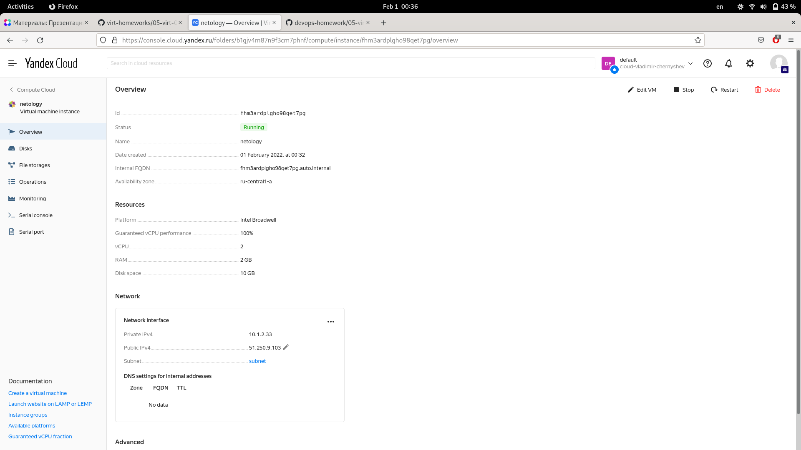

Домашнее задание к занятию "5.4. Оркестрация группой Docker контейнеров на примере Docker Compose"
===

1. Создать собственный образ операционной системы с помощью Packer.
---
		[vagrant@localhost ~]$ sudo dnf install packer
		[..]
		[vagrant@localhost ~]$ packer -v
		1.7.9

docker-rocky.pkr.hcl:

		packer {  
		  required_plugins {  
		    docker = {  
		      version = ">= 0.0.7"  
		      source = "github.com/hashicorp/docker"  
		    }  
		  }  
		}  
		
		source "docker" "rocky" {  
		  image  = "rockylinux"  
		  commit = true  
		}  
		
		build {  
		  name    = "rocky-linux"  
		  sources = [  
		    "source.docker.rocky"  
		    ]
		  }

		[vagrant@localhost ~]$ packer init docker-rocky.pkr.hcl   
		Installed plugin github.com/hashicorp/docker v1.0.3 in "/home/vagrant/.config/packer/plugins/github.com/hashicorp/docker/packer-plugin-docker_v1.0.3_x5.0_linux_amd64  "

		[vagrant@localhost ~]$ packer validate docker-rocky.pkr.hcl   
		The configuration is valid.  

		[vagrant@localhost ~]$ docker login docker.io
		Username: vladimirchernyshev
		Password: 
		Login Succeeded!

		[vagrant@localhost ~]$ packer build  docker-rocky.pkr.hcl 
		rocky-linux.docker.rocky: output will be in this color.

		==> rocky-linux.docker.rocky: Creating a temporary directory for sharing data...
		==> rocky-linux.docker.rocky: Pulling Docker image: rockylinux
		    rocky-linux.docker.rocky: Resolving "rockylinux" using unqualified-search registries (/etc/containers/registries.conf)
		    rocky-linux.docker.rocky: Trying to pull registry.fedoraproject.org/rockylinux:latest...
		    rocky-linux.docker.rocky: Trying to pull registry.access.redhat.com/rockylinux:latest...
		    rocky-linux.docker.rocky: Trying to pull registry.centos.org/rockylinux:latest...
		    rocky-linux.docker.rocky: Trying to pull docker.io/library/rockylinux:latest...
		    rocky-linux.docker.rocky: Getting image source signatures
		    rocky-linux.docker.rocky: Copying blob sha256:72a2451028f11c6927678e5f1bb8f35b4e723d3b342ec1a6980d7b5591cf81d6
		    rocky-linux.docker.rocky: Copying blob sha256:72a2451028f11c6927678e5f1bb8f35b4e723d3b342ec1a6980d7b5591cf81d6
		    rocky-linux.docker.rocky: Copying config sha256:210996f98b856d7cd00496ddbe9412e73f1c714c95de09661e07b4e43648f9ab
		    rocky-linux.docker.rocky: Writing manifest to image destination
		    rocky-linux.docker.rocky: Storing signatures
		    rocky-linux.docker.rocky: 210996f98b856d7cd00496ddbe9412e73f1c714c95de09661e07b4e43648f9ab
		==> rocky-linux.docker.rocky: Starting docker container...
		    rocky-linux.docker.rocky: Run command: docker run -v /home/vagrant/.config/packer/tmp3911498166:/packer-files -d -i -t --entrypoint=/bin/sh -- rockylinux
		    rocky-linux.docker.rocky: Container ID: c08d7e3111a271c3bb54e6c530a41182a81f8891d12ebcc6e064f4064c5467cf
		==> rocky-linux.docker.rocky: Using docker communicator to connect:
		==> rocky-linux.docker.rocky: Committing the container
		    rocky-linux.docker.rocky: Image ID: e84a16ccbde6ec177b83eadc8f9cd49e4e0e2b1daa07fbd9f1eb163e65107018
		==> rocky-linux.docker.rocky: Killing the container: c08d7e3111a271c3bb54e6c530a41182a81f8891d12ebcc6e064f4064c5467cf
		Build 'rocky-linux.docker.rocky' finished after 38 seconds 904 milliseconds.
		
		==> Wait completed after 38 seconds 904 milliseconds

		==> Builds finished. The artifacts of successful builds are:
		--> rocky-linux.docker.rocky: Imported Docker image: e84a16ccbde6ec177b83eadc8f9cd49e4e0e2b1daa07fbd9f1eb163e65107018
		
2. Создать вашу первую виртуальную машину в Яндекс.Облаке.
---

[Документация по yc](https://cloud.yandex.ru/docs/cli/quickstart)

		[vagrant@localhost ~]$ curl https://storage.yandexcloud.net/yandexcloud-yc/install.sh | bash
		  % Total    % Received % Xferd  Average Speed   Time    Time     Time  Current
		                                 Dload  Upload   Total   Spent    Left  Speed
		100  9739  100  9739    0     0  10942      0 --:--:-- --:--:-- --:--:-- 10942
		Downloading yc 0.87.0
		  % Total    % Received % Xferd  Average Speed   Time    Time     Time  Current
		                                 Dload  Upload   Total   Spent    Left  Speed
		100 81.2M  100 81.2M    0     0  3315k      0  0:00:25  0:00:25 --:--:-- 3140k
		Yandex.Cloud CLI 0.87.0 linux/amd64

		[vagrant@localhost ~]$ yc init
		Welcome! This command will take you through the configuration process.
		Please go to https://oauth.yandex.ru/authorize?response_type=token&client_id=1a6990aa636648e9b2ef855fa7bec2fb in order to obtain OAuth token.
		
		Please enter OAuth token: AQAAABBcwwNfAATuwWHw6lu04ENCpT40ycwkKVY
		You have one cloud available: 'cloud-vladimir-chernyshev' (id = b1ggcdrqmflvn13nfa6d). It is going to be used by default.
		Please choose folder to use:
		 [1] default (id = b1gjv4m87n9f3cm7phnf)
		 [2] Create a new folder
		Please enter your numeric choice: 1
		Your current folder has been set to 'default' (id = b1gjv4m87n9f3cm7phnf).
		Do you want to configure a default Compute zone? [Y/n] y
		Which zone do you want to use as a profile default?
		 [1] ru-central1-a
		 [2] ru-central1-b
		 [3] ru-central1-c
		 [4] Don't set default zone
		Please enter your numeric choice: 1
		Your profile default Compute zone has been set to 'ru-central1-a'.

		[vagrant@localhost ~]$ yc vpc network create --name net --labels label=netology --description 'created via yc'
		id: enpof3q9e0cqbuorfq8v
		folder_id: b1gjv4m87n9f3cm7phnf
		created_at: "2022-01-30T10:57:30Z"
		name: net
		description: created via yc
		labels:
		  label: netology

		[vagrant@localhost ~]$ yc vpc subnet create --name subnet --zone ru-central1-a --range 10.1.2.0/24 --network-name net --description 'created via yc'
		id: e9bcq4k91p3lbgccv2t3
		folder_id: b1gjv4m87n9f3cm7phnf
		created_at: "2022-01-30T11:18:36Z"
		name: subnet
		description: created via yc
		network_id: enpof3q9e0cqbuorfq8v
		zone_id: ru-central1-a
		v4_cidr_blocks:
		- 10.1.2.0/24

В файл-шаблон для *packer* нужно внести OAuth, идентификатор каталога (folder_id) и идентификатор подсети (id), [документация](https://cloud.yandex.ru/docs/solutions/infrastructure-management/packer-quickstart)

		[vagrant@localhost ~]$ packer validate centos-7-base.json 
		The configuration is valid.

		[vagrant@localhost ~]$ packer build centos-7-base.json
		[..]
		==> Builds finished. The artifacts of successful builds are:
		--> yandex: A disk image was created: centos-7-base (id: fd852huvj9phh6ossp6h) with family name centos

		[vagrant@localhost ~]$ yc compute image list
		+----------------------+---------------+--------+----------------------+--------+
		|          ID          |     NAME      | FAMILY |     PRODUCT IDS      | STATUS |
		+----------------------+---------------+--------+----------------------+--------+
		| fd852huvj9phh6ossp6h | centos-7-base | centos | f2e6u62hbpkah20ftmhi | READY  |
		+----------------------+---------------+--------+----------------------+--------+
		
Настройка [terraform](https://cloud.yandex.ru/docs/solutions/infrastructure-management/terraform-quickstart)

		[vagrant@localhost ~]$ mkdir yc-terraform
		[vagrant@localhost ~]$ vi yc-terraform/netology.tf

		terraform {
		  required_providers {
		    yandex = {
		      source  = "yandex-cloud/yandex"
		      version = "0.70.0"
		    }
		  }
		}

		provider "yandex" {
		  token     = "AQAAArBBcwwNfAATuwWHw6lu04ENCpT40ycwkKVY"
		  cloud_id  = "b1ggcdrqmflvn13nfa6d"
		  folder_id = "b1gjv4m87n9f3cm7phnf"
		  zone      = "ru-central1-a"
		}

		[vagrant@localhost yc-terraform]$ terraform init

		Initializing the backend...

		Initializing provider plugins...
		- Finding yandex-cloud/yandex versions matching "0.70.0"...
		- Installing yandex-cloud/yandex v0.70.0...
		- Installed yandex-cloud/yandex v0.70.0 (self-signed, key ID E40F590B50BB8E40)

[Конфигурация](https://cloud.yandex.com/en-ru/docs/compute/operations/vm-create/create-linux-vm
) виртуальной машины в файле main.tf:

		resource "yandex_compute_instance" "vm-1" {
		  name = "netology"

		  resources {
		    cores  = 2
		    memory = 2
		  }

		  boot_disk {
		    initialize_params {
		      image_id = "fd852huvj9phh6ossp6h"
		    }
		  }
		
		  network_interface {
		    subnet_id = "e9bcq4k91p3lbgccv2t3"
		    nat       = true
		  }

		  metadata = {
		    ssh-keys = "centos:${file("~/yc-terraform/yc.pub")}"
		  }
		}

		[vagrant@localhost yc-terraform]$ terraform validate 
		Success! The configuration is valid.
		[vagrant@localhost yc-terraform]$ terraform plan
		[..]

		[vagrant@localhost yc-terraform]$ terraform apply
		[..]
		yandex_compute_instance.vm-1: Creating...
		yandex_compute_instance.vm-1: Still creating... [10s elapsed]
		yandex_compute_instance.vm-1: Still creating... [20s elapsed]
		yandex_compute_instance.vm-1: Still creating... [30s elapsed]
		yandex_compute_instance.vm-1: Still creating... [40s elapsed]
		yandex_compute_instance.vm-1: Still creating... [50s elapsed]
		yandex_compute_instance.vm-1: Creation complete after 50s [id=fhm5g4q9ju3sq0jd04gi]

		Apply complete! Resources: 1 added, 0 changed, 0 destroyed.

