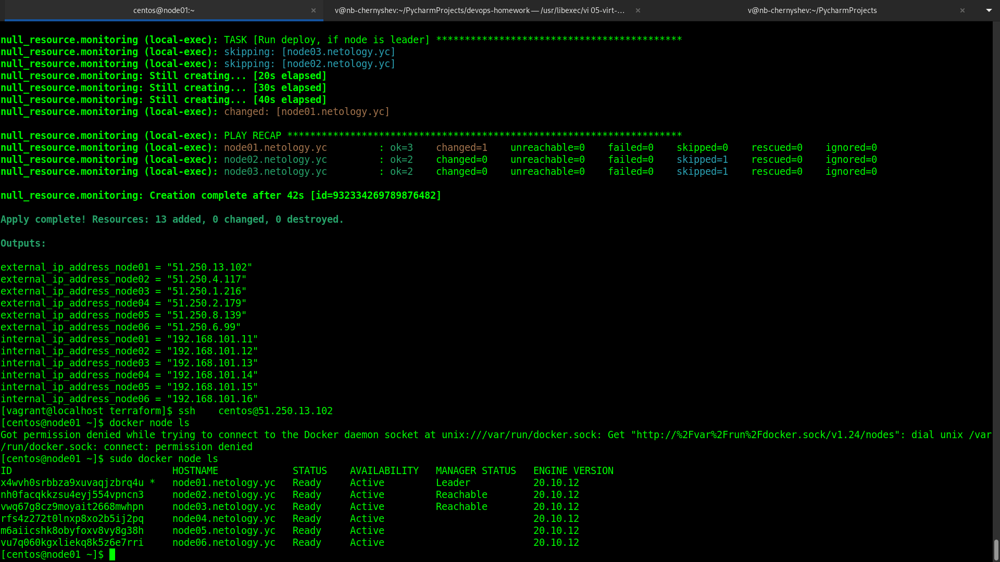
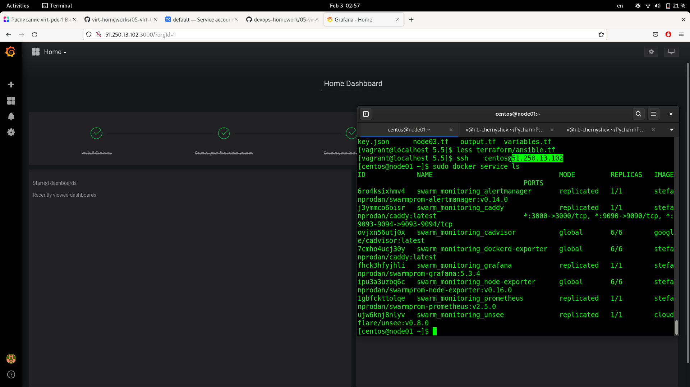

Домашнее задание к занятию "5.5. Оркестрация кластером Docker контейнеров на примере Docker Swarm"
===

1. 
---

-  В чём отличие режимов работы сервисов в Docker Swarm кластере: replication и global?  
 [Документация](https://docs.docker.com/engine/swarm/how-swarm-mode-works/services/): в replicated создается явно указанное количество реплик сервиса, в global создается по одной реплике сервиса на каждом узле своры.
-  Какой алгоритм выбора лидера используется в Docker Swarm кластере?  
 Используется алгоритм распределенного соглашения [Raft](https://docs.docker.com/engine/swarm/raft/)  
-  Что такое Overlay Network?  
 [Наложенная сеть](https://docs.docker.com/network/overlay/) между хостами, на которых запущены docker-демоны, трафик шифруется с помощью IPsec.

2. Создать ваш первый Docker Swarm кластер в Яндекс.Облаке
---

Сначала нужно создать service account с помощью UI Яндекс-облака, затем, согласно [документации](https://cloud.yandex.com/en-ru/docs/iam/operations/iam-token/create-for-sa#keys-create), 
 
		[vagrant@localhost terraform]$ yc iam key create --service-account-name netology --folder-id b1gjv4m87n9f3cm7phnf --output key.json
		id: aje0phigchm1079apvf0
		service_account_id: ajelo3r8mt49k761tqdl
		created_at: "2022-02-02T21:29:43.589101785Z"
		key_algorithm: RSA_2048

		[vagrant@localhost terraform]$ vi variables.tf
		[vagrant@localhost terraform]$ terraform init
		[vagrant@localhost terraform]$ terraform validate
		[vagrant@localhost terraform]$ terraform plan
		[vagrant@localhost terraform]$ terraform apply
		[..]
		Apply complete! Resources: 13 added, 0 changed, 0 destroyed.
		
		Outputs:

		external_ip_address_node01 = "51.250.13.102"
		external_ip_address_node02 = "51.250.4.117"
		external_ip_address_node03 = "51.250.1.216"
		external_ip_address_node04 = "51.250.2.179"
		external_ip_address_node05 = "51.250.8.139"
		external_ip_address_node06 = "51.250.6.99"
		internal_ip_address_node01 = "192.168.101.11"
		internal_ip_address_node02 = "192.168.101.12"
		internal_ip_address_node03 = "192.168.101.13"
		internal_ip_address_node04 = "192.168.101.14"
		internal_ip_address_node05 = "192.168.101.15"
		internal_ip_address_node06 = "192.168.101.16"

3. Создать ваш первый, готовый к боевой эксплуатации кластер мониторинга, состоящий из стека микросервисов.
---

