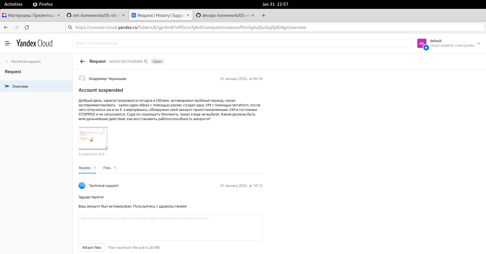
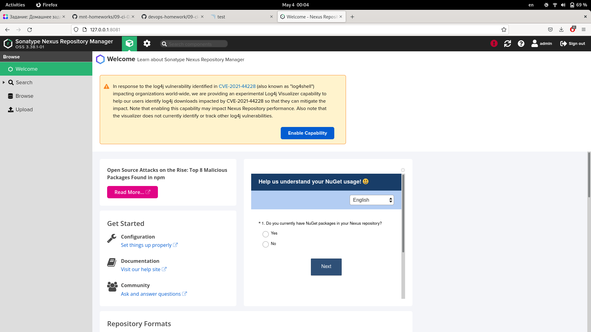

Домашнее задание к занятию "09.02 CI\CD"
===
1. Знакомоство с SonarQube
---
	$ docker pull sonarqube:8.7-community
	Emulate Docker CLI using podman. Create /etc/containers/nodocker to quiet msg.
	✔ docker.io/library/sonarqube:8.7-community
	Trying to pull docker.io/library/sonarqube:8.7-community...
	[..]

	$ docker run -d --name sonarqube -e SONAR_ES_BOOTSTRAP_CHECKS_DISABLE=true -p 9000:9000 sonarqube:8.7-community
	059c526604bbe11ca1ea030e26075d215205629b914cdaa05cc5b5a8ae30eff2

 [ГДЕ ВЗЯТЬ УСТАНОВОЧНЫЙ zip-ФАЙЛ](https://binaries.sonarsource.com/?prefix=Distribution/sonar-scanner-cli/)

	[v@nb-chernyshev devops-homework]$ sonar-scanner --version
	INFO: Scanner configuration file: /home/v/bin/sonar-scanner/conf/sonar-scanner.properties
	INFO: Project root configuration file: NONE
	INFO: SonarScanner 4.7.0.2747
	INFO: Java 11.0.14.1 Red Hat, Inc. (64-bit)
	INFO: Linux 5.16.20-200.fc35.x86_64 amd64

Запуск сканнера для файла fail.py: 

	[v@nb-chernyshev 09-ci-02-cicd]$ sonar-scanner   -Dsonar.projectKey=test   -Dsonar.sources=.   -Dsonar.host.url=http://127.0.0.1:9000   -Dsonar.login=a41c3893669707653c3c554cd906d9e4b440cca1 -Dsonar.coverage.exclusions=fail.py

Результат после исправления ошибок:

2. Знакомство с Nexus
---

	[v@nb-chernyshev ~]$ docker pull sonatype/nexus3
	Emulate Docker CLI using podman. Create /etc/containers/nodocker to quiet msg.
	✔ docker.io/sonatype/nexus3:latest
	Trying to pull docker.io/sonatype/nexus3:latest...
	[..]

	[v@nb-chernyshev ~]$ docker run -d -p 8081:8081 --name nexus sonatype/nexus3
	Emulate Docker CLI using podman. Create /etc/containers/nodocker to quiet msg.
	006bc2cc760cdd89d0d3e8102d9258ad9a05b6f61dc30868a223fe15e5fdd5c8

	docker exec -it nexus /bin/bashsh
	Emulate Docker CLI using podman. Create /etc/containers/nodocker to quiet msg.
	bash-4.4$ cat nexus-data/admin.password 
	2a6b3053-0252-4081-b85b-68378b5b8441

