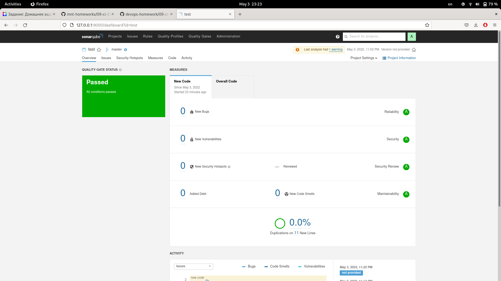

Домашнее задание к занятию "09.02 CI\CD"
===
1. Знакомоство с SonarQube
---
	$ docker pull sonarqube:8.7-community
	Emulate Docker CLI using podman. Create /etc/containers/nodocker to quiet msg.
	✔ docker.io/library/sonarqube:8.7-community
	Trying to pull docker.io/library/sonarqube:8.7-community...
	Getting image source signatures
	Copying blob 22599d3e9e25 skipped: already exists  
	Copying blob 00bb4d95f2aa skipped: already exists  
	Copying blob 928990dd1bda done  
	Copying blob 3ef8cf8a60c8 done  
	Copying blob 07cca701c22e done  
	Copying config a4947e146b done  
	Writing manifest to image destination
	Storing signatures
	a4947e146b7537327e9d8467689953e7cc6de2e943b1859876976b43af483c56

	$ docker run -d --name sonarqube -e SONAR_ES_BOOTSTRAP_CHECKS_DISABLE=true -p 9000:9000 sonarqube:8.7-community
	059c526604bbe11ca1ea030e26075d215205629b914cdaa05cc5b5a8ae30eff2

 [ГДЕ ВЗЯТЬ УСТАНОВОЧНЫЙ zip-ФАЙЛ](https://binaries.sonarsource.com/?prefix=Distribution/sonar-scanner-cli/)

		[v@nb-chernyshev devops-homework]$ sonar-scanner --version
		INFO: Scanner configuration file: /home/v/bin/sonar-scanner/conf/sonar-scanner.properties
		INFO: Project root configuration file: NONE
		INFO: SonarScanner 4.7.0.2747
		INFO: Java 11.0.14.1 Red Hat, Inc. (64-bit)
		INFO: Linux 5.16.20-200.fc35.x86_64 amd64

Запуск сканнера для файла fail.py: 

		[v@nb-chernyshev 09-ci-02-cicd]$ sonar-scanner   -Dsonar.projectKey=test   -Dsonar.sources=.   -Dsonar.host.url=http://127.0.0.1:9000   -Dsonar.login=a41c3893669707653c3c554cd906d9e4b440cca1 -Dsonar.coverage.exclusions=fail.py

Результат после исправления ошибок:

