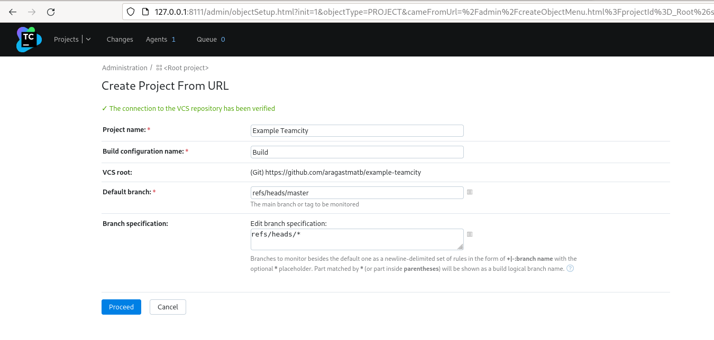
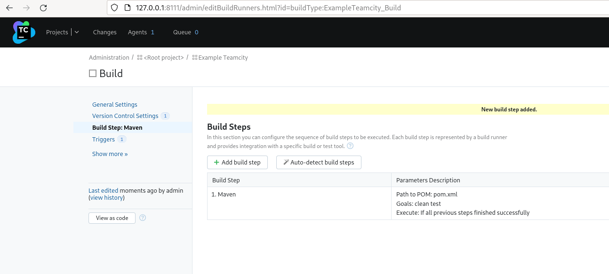

Домашнее задание к занятию "09.04 Teamcity"
===

Подготовка инфраструктуры.
---

docker-compose.yml

	version: "3"
	services:
	  teamcity:
	    image: jetbrains/teamcity-server
	    volumes:
	      - type: volume
	        source: data
	        target: /data/teamcity_server/datadir
	      - type: volume
	        source: logs
	        target: /opt/teamcity/logs
	    ports:
	      - 8111:8111
	  teamcity-agent:
	    image: jetbrains/teamcity-agent 
	    depends_on:
	      - teamcity
	    volumes:
	      - type: volume
	        source: logs
	        target: /data/teamcity_agent/conf 
	    environment:
	      SERVER_URL: "http://teamcity:8111"
	
	volumes:
	    data:
	    logs:
	    agent:

Предварительное удаление контейнеров, образов, томов:

	docker rm -a
	docker image rm -a
	docker volume rm -a

Запуск docker-compose от текущего непрепилегированного пользователя (v):
[Running Docker Compose with Rootless Podman](https://fedoramagazine.org/use-docker-compose-with-podman-to-orchestrate-containers-on-fedora/)

	systemctl --user enable podman.socket
	systemctl --user start podman.socket
	systemctl --user status podman.socket
	export DOCKER_HOST=unix:///run/user/$UID/podman/podman.sock

	 docker-compose up

Основная часть
---
1. Создайте новый проект в teamcity на основе fork

2. Сделайте autodetect конфигурации

Запуск autodetect неуспешен.

