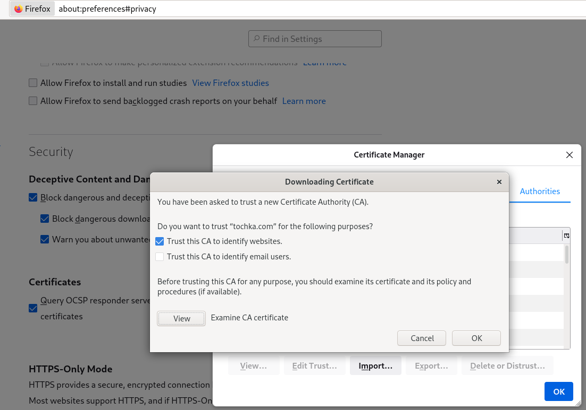
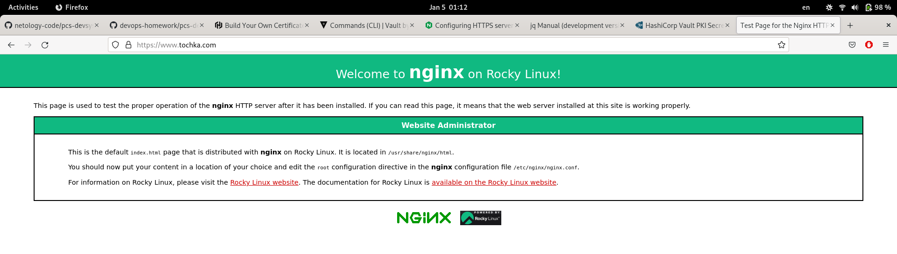
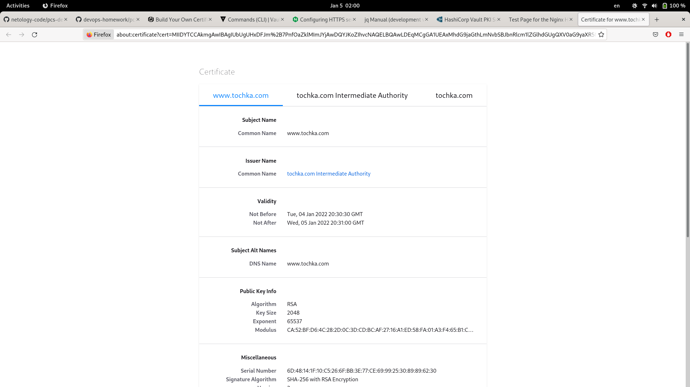
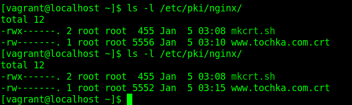
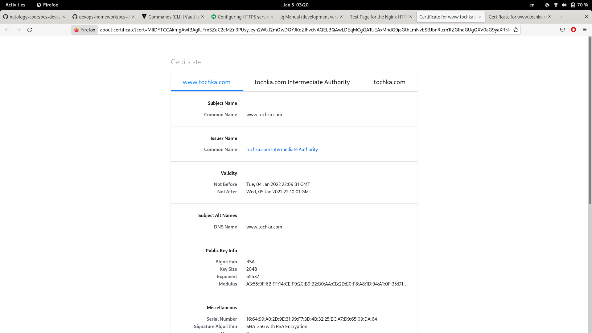
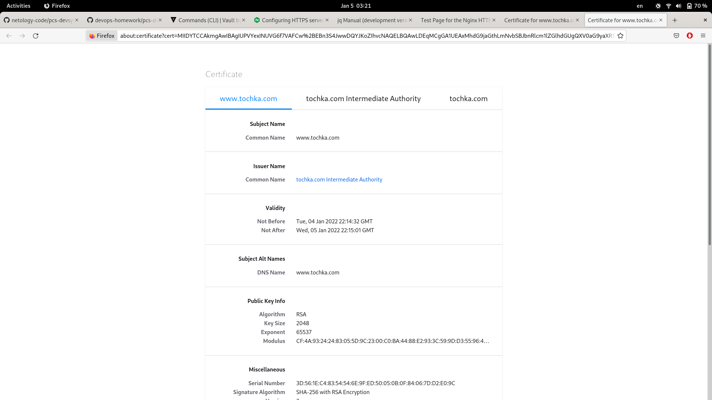

Курсовая работа по итогам модуля "DevOps и системное администрирование"
===
1. Создайте виртуальную машину Linux.
---
 Добавим вторую вирутальную машину в Vagrantfile согласно [документации](https://www.vagrantup.com/docs/multi-machine):
Vagrantfile:

>Vagrant.configure("2") do |config|  
>  config.vm.define "ubuntu" do |ubt|  
>    ubt.vm.box = "bento/ubuntu-20.04"  
>  end  
>  config.vm.define "rocky" do |rck|  
>    rck.vm.box = "bento/rockylinux-8"  
>  end  
> config.vm.network "private_network", type: "dhcp"  
> config.vm.network "forwarded_port", guest: 22, host: 2222, auto_correct: true  
> config.vm.network "forwarded_port", guest: 80, host: 8080, auto_correct: true  
> config.vm.network "forwarded_port", guest: 443, host: 8443, auto_correct: true  
>end  

	$vagrant up rocky
	$vagrant ssh rocky

2. Установите ufw и разрешите к этой машине сессии на порты 22 и 443, при этом трафик на интерфейсе localhost (lo) должен ходить свободно на все порты.
---

В Телеграмм-чате курса был задан вопрос и эксперт Булат Замилов уточнил, что использование конкретно *ufw* не принципиально, будет использован *firewalld* - связано со спецификой основной работы.

Включение **firewalld** и разрешение сервисов **ssh**, **https**:

	$ sudo systemctl enable firewalld
	$ sudo systemctl start firewalld  
	$ sudo firewall-cmd --get-zone-of-interface=lo

>	no zone  

	$ sudo firewall-cmd --get-active-zones

>	public  
>	  interfaces: eth0 eth1  

	$ sudo firewall-cmd --info-zone=public  

>	public (active)  
>	  target: default  
>	  icmp-block-inversion: no  
>	  interfaces: eth0 eth1  
>	  sources:   
>	  services: cockpit dhcpv6-client ssh  
>	  ports:   
>	  protocols:   
>	  forward: no  
>	  masquerade: no  
>	  forward-ports:   
>	  source-ports:   
>	  icmp-blocks:   
>	  rich rules:   

	$ sudo firewall-cmd --add-service=https
	$ sudo firewall-cmd --remove-service=cockpit --remove-service=dhcpv6-client
	$ sudo firewall-cmd --info-zone=public

>	public (active)  
>	  target: default  
>	  icmp-block-inversion: no  
>	  interfaces: eth0 eth1  
>	  sources:   
>	  services: https ssh  
>	  ports:   
>	  protocols:   
>	  forward: no  
>	  masquerade: no  
>	  forward-ports:   
>	  source-ports:   
>	  icmp-blocks:   
>	  rich rules:   

	$ sudo firewall-cmd --runtime-to-permanent

3. Установите Hashicorp **vault**:
---

Установка пакета:

	$ sudo dnf install -y dnf-plugins-core
	$ sudo dnf config-manager --add-repo https://rpm.releases.hashicorp.com/RHEL/hashicorp.repo
	$ sudo dnf -y install vault
	$ sudo dnf -y install jq

4. Cоздайте центр сертификации и выпустите сертификат для использования его в настройке веб-сервера **nginx**.
---

В установленный пакет **vault** входит и файл конфигурации, и service-файл для **systemd**:

	$ cat /etc/vault.d/vault.hcl | sed /^#/d

>	ui = true  
>	storage "file" {  
>	  path = "/opt/vault/data"  
>	}  
>	listener "tcp" {  
>	  address = "127.0.0.1:8201"  
>	  tls_disable = 1  
>	}  
>	listener "tcp" {  
>	  address       = "0.0.0.0:8200"  
>	  tls_cert_file = "/opt/vault/tls/tls.crt"  
>	  tls_key_file  = "/opt/vault/tls/tls.key"  
>	}  

	$ cat /usr/lib/systemd/system/vault.service

>	EnvironmentFile=/etc/vault.d/vault.env  
>	User=vault  
>	Group=vault  
>	ExecStart=/usr/bin/vault server -config=/etc/vault.d/vault.hcl  

	$ sudo systemctl enable vault
	$ sudo systemctl start vault
	$ sudo systemctl status vault

	● vault.service - "HashiCorp Vault - A tool for managing secrets"
	   Loaded: loaded (/usr/lib/systemd/system/vault.service; enabled; vendor pres>
	   Active: active (running) since Sun 2022-01-02 07:54:50 UTC; 1min 3s ago
	     Docs: https://www.vaultproject.io/docs/
	 Main PID: 2117 (vault)
	    Tasks: 7 (limit: 4964)
	   Memory: 58.0M
	   CGroup: /system.slice/vault.service
	           └─2117 /usr/bin/vault server -config=/etc/vault.d/vault.hcl

 Инициализация **vault** согласно [документации](https://learn.hashicorp.com/tutorials/vault/getting-started-deploy?in=vault/getting-started):

	$  VAULT_ADDR='http://127.0.0.1:8201' vault operator init

>	Unseal Key 1: xE7rpOmFc9jdYF75XCCyWePECajYxGMgnlWdwyMYalwG  
>	Unseal Key 2: uOtdh6nFRlnP2c+uPcWqSPM6L3SWjpHWvdMXqjlLQYHr  
>	Unseal Key 3: 0QbeD5UzEMX+MfIk+jWsmpMyOvrRTvYwJFdC+KReMn1V  
>	Unseal Key 4: L7VUKdO5aWExnJCdRxnRr1Pcj/8zhvwGa+3ftRqVSHss  
>	Unseal Key 5: jivC3cQsxY/Ce1buvuSAAS1K/gNPGRHVWQ1BzERcqakV  
>	
>	Initial Root Token: s.fFQuxB0CuEHM1VoSDfxSfZno    

Распечатываем **vault** тремя ключами из вывода предыдущей команды:

	$ VAULT_ADDR='http://127.0.0.1:8201' vault operator unseal
	Key             Value
	---             -----
	Seal Type       shamir
	Initialized     true
	Sealed          false
	Total Shares    5
	Threshold       3
	Version         1.9.2
	Storage Type    file
	Cluster Name    vault-cluster-d029a572
	Cluster ID      4715631e-38d1-462e-97a5-f10e237a3b1e
	HA Enabled      false

Аутентификация корневым токеном:

	$ VAULT_ADDR='http://127.0.0.1:8201' vault login s.fFQuxB0CuEHM1VoSDfxSfZno
	Success! You are now authenticated. The token information displayed below
	is already stored in the token helper. You do NOT need to run "vault login"
	again. Future Vault requests will automatically use this token.
	
	Key                  Value
	---                  -----
	token                s.fFQuxB0CuEHM1VoSDfxSfZno
	token_accessor       B8olHZS9czuFWFccOdyaDmLX
	token_duration       ∞
	token_renewable      false
	token_policies       ["root"]
	identity_policies    []
	policies             ["root"]

Подготовка политики:

	$ vi vault_pki_pol.hcl
	path "sys/mounts/*" {
	  capabilities = [ "create", "read", "update", "delete", "list" ]
	}
	path "sys/mounts" {
	  capabilities = [ "read", "list" ]
	}
	path "pki*" {
	  capabilities = [ "create", "read", "update", "delete", "list", "sudo" ]
	}

	$ VAULT_ADDR='http://127.0.0.1:8201' vault policy write pki ./vault_pki_pol.hcl 
	Success! Uploaded policy: pki

Генерация самоподписного корневого сертификата:

	$ export VAULT_ADDR='http://127.0.0.1:8201' VAULT_TOKEN=s.fFQuxB0CuEHM1VoSDfxSfZno
	$  vault secrets enable pki
	Success! Enabled the pki secrets engine at: pki/
	$  vault secrets tune -max-lease-ttl=87600h pki
	Success! Tuned the secrets engine at: pki/
	$  vault write -field=certificate pki/root/generate/internal common_name="tochka.com" ttl=87600h > CA.crt
	$  vault write pki/config/urls issuing_certificates="$VAULT_ADDR/v1/pki/ca" crl_distribution_points="$VAULT_ADDR/v1/pki/crl"
	Success! Data written to: pki/config/urls

Генерация промежуточного сертификата:

	$ vault secrets enable -path=pki_int pki
	Success! Enabled the pki secrets engine at: pki_int/
	$ vault secrets tune -max-lease-ttl=43800h pki_int
	Success! Tuned the secrets engine at: pki_int/
	$ vault write -format=json pki_int/intermediate/generate/internal common_name="tochka.com Intermediate Authority" | jq -r '.data.csr' > pki_intermediate.csr
	$ vault write -format=json pki/root/sign-intermediate csr=@pki_intermediate.csr format=pem_bundle ttl="43800h" | jq -r '.data.certificate' > intermediate.cert.pem
	$ vault write pki_int/intermediate/set-signed certificate=@intermediate.cert.pem
	Success! Data written to: pki_int/intermediate/set-signed

Создание роли tochka-dot-com:

	$ vault write pki_int/roles/tochka-dot-com allowed_domains="tochka.com" allow_subdomains=true max_ttl="720h"
	Success! Data written to: pki_int/roles/tochka-dot-com

Выпуск сертификатов для www.tochka.com со сроком жизник 24 часа:

	$ vault write pki_int/issue/tochka-dot-com common_name="www.tochka.com" ttl="24h" > www.tochka.com.crt

[Еще документ](https://www.vaultproject.io/docs/secrets/pki)

5. Установите корневой сертификат созданного центра сертификации в доверенные в хостовой системе.
---

Созданный корневой сертификат копируется на хостовую систему и добавляется как доверенный в 

6. Установите **nginx**.

	$ sudo dnf install nginx

7. Настройте **nginx** на https, используя ранее подготовленный сертификат.
---

Согласно [документации](https://nginx.org/en/docs/http/configuring_https_servers.html), **nginx** может читать и сертификат, и ключ из одного файла, причем клиенту отсылается только сертификат. Кроме того, в тот же файл можно включить всю цепочку сертификатов до корневого, для этого требуется чтобы сертификать сервера **nginx** в файле размещался ранее цепочки сертификатов.
 Скрипт **mkcrt.sh**, записывающий сертификат, ключ, цепочку доверия в нужном **nginx** порядке:

	#! /bin/sh
	#google-fu://tekanaid.com/posts/hashicorp-vault-pki-secrets-engine-demo-for-certificate-management/
	
	#where we put certificate
	cert=/etc/pki/nginx/www.tochka.com.crt
	umask 0177
	tmp=$(mktemp)
	VAULT_ADDR='http://127.0.0.1:8201' VAULT_TOKEN=s.fFQuxB0CuEHM1VoSDfxSfZno vault write pki_int/issue/tochka-dot-com common_name="www.tochka.com" ttl="24h" -format=json > $tmp
	cat $tmp | jq -r '.data.certificate' > $cert
	cat $tmp | jq -r '.data.private_key' >> $cert
	cat $tmp | jq -r '.data.issuing_ca' >> $cert
	cat $tmp | jq -r '.data.ca_chain[]' >> $cert
	rm -f $tmp

Конфигурация **nginx**:

	$ sudo vi /etc/nginx/nginx.conf

	    server {
	        listen			443 ssl;
	        server_name		www.tochka.com;
		ssl_certificate		"/etc/pki/nginx/www.tochka.com.crt";
		ssl_certificate_key	"/etc/pki/nginx/www.tochka.com.crt";
	        ssl_protocols		TLSv1.3
		}
	[..]

Запуск **nginx**:

	$ sudo systemctl enable nginx
	Created symlink /etc/systemd/system/multi-user.target.wants/nginx.service → /usr/lib/systemd/system/nginx.service.
	$ sudo systemctl start nginx

----
На компьютере-клиенте
Добавлена статическая DNS-запись в */etc/hosts*:

	192.168.56.4    www.tochka.com

[v@nb-chernyshev ~]$  openssl s_client -connect www.tochka.com:443
CONNECTED(00000003)
depth=1 CN = tochka.com Intermediate Authority
verify error:num=20:unable to get local issuer certificate
verify return:1
depth=0 CN = www.tochka.com
verify return:1
---
Certificate chain
 0 s:CN = www.tochka.com
   i:CN = tochka.com Intermediate Authority
 1 s:CN = tochka.com Intermediate Authority
   i:CN = tochka.com
 2 s:CN = tochka.com Intermediate Authority
   i:CN = tochka.com

8. Откройте в браузере на хосте https адрес страницы, которую обслуживает сервер nginx.
---

В отличии от **s_client**, в *Mozilla Firefox* добавлен корневой самоподписанный сертификат (см. п. 5).

9. Создайте скрипт, который будет генерировать новый сертификат в vault:
---

В скрипт из п.7 добавлена команда перезапуска **nginx** после перевыпуска сертификата:

	#! /bin/sh
	
	cert=/etc/pki/nginx/www.tochka.com.crt
	tmp=$(mktemp)
	VAULT_ADDR='http://127.0.0.1:8201' VAULT_TOKEN=s.fFQuxB0CuEHM1VoSDfxSfZno vault write pki_int/issue/tochka-dot-com common_name="www.tochka.com" ttl="24h" -format=json > $tmp
	cat $tmp | jq -r '.data.certificate' > $cert
	cat $tmp | jq -r '.data.private_key' >> $cert
	cat $tmp | jq -r '.data.issuing_ca' >> $cert
	cat $tmp | jq -r '.data.ca_chain[]' >> $cert
	systemctl reload nginx
	rm -f $tmp

10. Поместите скрипт в crontab, чтобы сертификат обновлялся какого-то числа каждого месяца в удобное для вас время.
---

Запуск скрипта из системного *crontab*, в порядке тестирования перевыпускаем сертификат каждые пять минут:

	$sudo vi /etc/crontab

	*/5  *  *  *  * root /etc/pki/nginx/mkcrt.sh

Время модификации файла с сертификатами меняется каждые пять минут:

Время окончания срока действия сертификата отличается на пять минут:

Настроен перевыпуск сертификата раз в сутки в 1:00 :

	/etc/crontab
	 0  1  * * * root /etc/pki/nginx/mkcrt.sh
